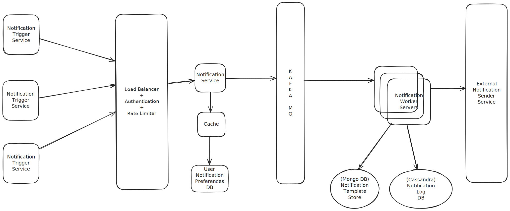

# Notification Service

---

This section outlines the key components and their roles within the Notification Service architecture.

## Components

* **Notification Trigger Services**
    These are external or internal services that initiate requests to send notifications. 
	When offering services to other clients, these trigger services expose APIs that clients can call to request notifications.

* **Authentication and Rate Limiter**
    This crucial component sits between the "Notification Trigger Services" and the "Notification Service" itself. 
	Its primary functions include:
    * **Authentication:** Verifying the identity and permissions of the caller (either a "Notification Trigger Service" or a direct client API call) 
	before allowing the request to proceed.
    * **Rate Limiting:** Controlling the number of API calls a specific "Notification Trigger Service" (or client) 
	can make within a defined timeframe. This prevents abuse, protects the notification system from being overloaded by excessive requests, and helps manage costs.