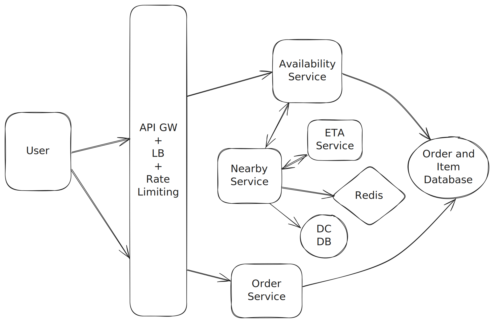

# Local Delivery System



## Core Entities

 Item - item_id, name
 Inventory - inventory_id, item_id, dc_id, quantity
 Delivery Center - dc_id, lat, long
 
 Order - order_id, price
 Order Item - order_item_id, item_id, qty, order_id

## Get products at nearby delivery center

1. The user sends a request to the availability service. The availability service then queries nearby services to find out delivery centers that are
closer the user. The user will send its location coordinates (lat, long) to the availability service and it will forward the same to the nearby service.

2. The nearby service will query an external ETA service whose job will be to figure out which DCs will be able to dispatch item to user within the promised servicing
time. For example a google maps sefvice might allow this.

3. Once the nearby service has all the Delivery centers that are nearby user, it will forward this information to the availability service and figure out 
all the available items that belong to a particular delivery location.

Once availability service has the `dc_id` it can run the following query to get a list of inventory items
```
SELECT i.inventory_id, i.dc_id, i.item_id, it.name AS item_name, i.quantity
FROM Inventory i
JOIN Item it ON i.item_id = it.item_id
WHERE i.dc_id IN (101, 102, 103);
```

to adhere to Single Responsibilty principle and enable separation of concerns, we can have separate databases for Delivery Centers and Item Inventory.
Also both these components can be scaled independently.

## Order Service Flow

One important thing the we need for order database is strong consistency.
We need strong consistency because we want to make sure the two users aren't ordering same items at the same time in a case when only limited quantity of item is present.

What we need, is that user places an order and once done the quantity (that was ordered) should be deducted from the inventory count of the product and all of this should happened
in a single transaction.
For this purpose, it makes sense to have both order and inventory details within the same database only.

By putting both orders and inventory in the same database, we can take advantage of the ACID properties of our Mysql table. Using a singular transaction with isolation level SERIALIZABLE we can ensure that the entire transaction is atomic. This means that if two users try to order the same item at the same time, one of them will be rejected. This is because the transaction will fail to commit if the inventory is not available.

**SERIALIZABLE** ensures that concurrent transactions execute as if they were run one after another (i.e., serially), even if they are actually interleaved in time.

## Some optimizations.

To store delivery centers, we will use posgres sql db with postgis extension, this will basically help us store the geohashes of the delivery centers.

We can also store geohash -> delivery_center mapping in a redis cache to create our lookup queries faster.
We can maintain a LRU cache such that only the most frequently check DCs remain in memory. 

Our availability service can query the cache for a given set of inputs and, if the cache hits, return that result. 
If the cache misses we'll do a lookup on the underlying database and then write the results into the cache. 
Setting a low TTL (e.g. 1 minute) ensures that these results are fresh.

Furthermore, we can partition our inventory database by grouping the inventory items that belong to some delivery centers in a region. We can group some Delivery centers
together with a region_id, this region id can be a geohash prefix upto a certain precision point. Why geo hash ? because if two geohashes are nearby then they will have a shared common prefix.
Using this region_id, we can now partition our inventory database.

We can also use read replicas for availability since we can tolerate a small amount of inconsistency. Our orders need to be strongly consistent, so those transactions need to be sent to the Postgres leader, but our availability queries can go to our read replicas.