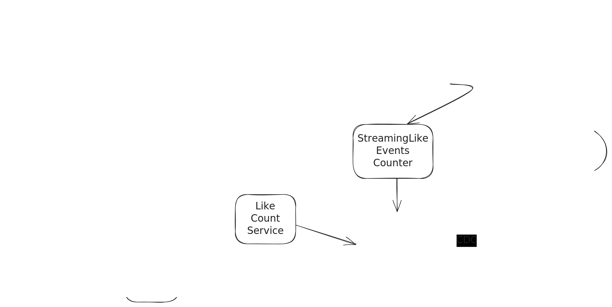
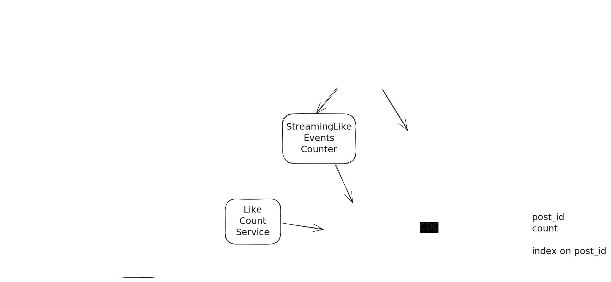

# Tweet Likes Counter



## Capacity Estimation

| Metric                               | Example Assumption                                      | Notes                                         |
| ------------------------------------ | ------------------------------------------------------- | --------------------------------------------- |
| **Daily active users (DAU)**         | 100 million                                             | Roughly 1/3 of total users                    |
| **Avg tweets per user per day**      | 5                                                       | Many users post or engage several times a day |
| **Tweets created per day**           | 100M × 5 = **500 million new tweets/day**               | Baseline for writes                           |
| **Avg likes per tweet**              | 10                                                      | Varies widely, but 10 is fine for reasoning   |
| **Like events per day**              | 500M tweets × 10 likes = **5 billion likes/day**        | Core counter write traffic                    |
| **Average like requests per second** | 5,000,000,000 / 86,400 ≈ **≈ 50,000 likes/sec average** | Rounded for reasoning                         |
| **Peak factor**                      | ×2                                                      | Social apps are very bursty                   |
| **Peak QPS**                         | 50K × 10 = **≈ 100K likes/sec peak**                    | Approximate upper bound                       |

What peak QPS tells me ?

100K likes per second means I’m designing for high throughput, not for big data.
The core challenge is write concurrency and hot tweets, so I’d use a distributed in-memory counter system — sharded by tweet ID, with sub-shards for hot keys.
Reads are 10× heavier, so I’d cache counts in Redis and persist snapshots periodically.
It’s a throughput and consistency trade-off problem, not a storage one.

## Using a relational database

```
User likes table
+-----------+-----------+---------------------+
| post_id   | user_id   | timestamp           |
+-----------+-----------+---------------------+
| INT       | INT       | DATETIME / TIMESTAMP|
+-----------+-----------+---------------------+

post_id → The ID of the post that was liked.

user_id → The ID of the user who liked the post.

timestamp → When the like happened.
```

The most trivial implementation of a counter is using the relational database. A low-traffic website can use a counter built with a single instance of the relational database

A naive implementation of the counter in the relational database uses a lock (mutex). The lock must be acquired before the count is incremented. 
The relational database with locks offers strong consistency. 
On the downside, this approach is not scalable when there are extremely high concurrent writes. Writes become a performance bottleneck.

To scale our DB layer we can shard our database, The consistent hashing algorithm can be used to partition the database. `post_id` can be used as th partitin key. The partitioning of the database only reduces the load on database instance. In addition, the database instances must be replicated for high availability.

The relational database offers the leader-follower replication. The load on the database can be further reduced by routing The writes to the leader instance while the reads are redirected to the follower instances.

The leader instance of the database accepts the writes and the written data will be asynchronously replicated to follower database instances.

The distributed counter should support extremely high concurrency and write-heavy load. The leader-follower replication topology of the relational database will result in write congestion and poor latency. 

For a distributed counter we need high availability and low latency.

* ❌ Poor Scalability: RDBMS scale poorly horizontally under high write loads.

* 🐢 High Latency: Each write involves transaction overhead and disk I/O, increasing latency.

* 🔥 Hotspotting: Popular posts become hot rows, leading to performance bottlenecks.

## Using a no sql database

We can use a no-sql database like a dynamodb which is designed for horizontal scaling.

Now if we move to dynamodb and use the same schema as shown before, it will result into a hot partition problem.

To solve that we can split the data into n partitions and append to partition number to the partition key such that our partition key now looks like this `post_id#k` where k is the partition number. Generate a random shard index from a predefined, small range (e.g., 0 to N−1, where N might be 10 to 100).

The only problem here is that now we have to query each partition for the likes and aggregate the count. 
This is not acceptable as we need low latency and near real time count.

Also, this is a write heavy system because at any time, the volume of people that are liking a post is a lot, and many write requests will end up overwhelming our db.

So what we can do is introduce a queue to throttle our writes a db.

With a kafka queue, we can figure our topic partition by hashing over the `post_id` such that all like activities over a post go through the same partition.
Also ordering within a partition is guaranteed. so all like events will be handled in a sequence. And we can use a consumer service which will handle these events and write to our db. This solves the write congestion issue.


## Realtime Reads

we need near real time count of likes, and if we are using a dynamodb, we still have to query the n partitions and sum up our results and then serve the like count.
Again this is not acceptable as the counts will take time and we need low latency for reads as well.

One approach would be to use a Counting Worker service whose job would be to periodically count the likes and store them separately in a K-V database, where key will be the post
and value will be the count of likes. to decrease the latency further, we can use a redis cache which will cache the data.

We will have a separate like count service that will read the like count of a post from the separate likes count db that we created. If it is able to find the count in cache, then fine otherwise it will query the likes-count-db to get the count.

The streaming likes event counter will count the events as they come and will store this count into the cache.
This service can take advantage of stream processing services such as Apache Flink to calculate the counter in real time.

The Tweet Likes Counter Batch Job periodically re-computes the count by simply counting the records in this durable database. Any overcounts or undercounts that may have occurred in the real-time stream due to network issues or retries are corrected when this batch job runs. The real-time stream simply provides a fast estimate of the count since the last batch run.

The CDC link between the Counter DB and the Counter Cache is the reconciliation bridge. When the Tweet Likes Counter Batch Job finishes its periodic re-computation and writes the accurate count to the Counter DB, the CDC system detects this change and pushes the new value directly to the Counter Cache. This overwrites the real-time, approximate count with the new, accurate one. This process ensures that the count displayed to the user is always up-to-date and converges to the correct value. The Like Count Service reading from the cache will simply serve the latest value available, whether it's from the real-time stream or the batch reconciliation.

## Upgrades



The batch job's requirement to scan the entire DynamoDB table to compute the accurate count is the primary scalability bottleneck of your original Lambda Architecture. As the raw event data (Tweet Likes DB) grows, the batch time will increase linearly, eventually making it impossible to compute a "fresh" definitive count within an acceptable time window.

Also given that we will not be storing an unlike event in the DB, if we make time based checkpoints for the batch job then we will not be able to accurately calculate the exact and accurate count of likes on a post.

Instead what we will do now is that the Tweets event consumer will now add likes to the database and if there is an unlike then the Consumer will delete the record.

Now every time a change is made in the database, the database CDC will send that change event to kafka and then the DB Change streamer will capture that change and maintain count record on counter DB.

Both the Event Consumer and the DB Change streamer will flush there changes in batches to increase the througput 

```
┌──────────────────────────────────────────────────────────────────┐
│                      TWEET LIKES DB (MAIN TABLE)                 │
├─────────────────┬─────────────────┬────────────────┬─────────────┤
│   Attribute     │     Key Role    │    Format      │  Purpose    │
├─────────────────┼─────────────────┼────────────────┼─────────────┤
│                 │                 │                │             │
│ShardedPartition │ PRIMARY KEY (PK)│ [Shard#PostID] │ SCALABILITY │
│Key              │                 │                │             │
├─────────────────┼─────────────────┼────────────────┼─────────────┤
│                 │                 │                │             │
│UserID           │ SORT KEY (SK)   │ user_abc123    │ UNIQUENESS  │
│                 │                 │                │ & DELETE    │
├─────────────────┼─────────────────┼────────────────┼─────────────┤
│PostID           │ Attribute       │ post_54321     │ (For Query) │
├─────────────────┼─────────────────┼────────────────┼─────────────┤
│Timestamp        │ Attribute       │ 1700000000     │ (For Audit) │
└─────────────────┴─────────────────┴────────────────┴─────────────┘
```

DynamoDB provides native CDC support through a feature called DynamoDB Streams.
The DynamoDB Stream itself is highly reliable, providing a time-ordered sequence of changes for up to 24 hours. Each record is tracked by a unique sequence number within a stream shard.

For your Counter DB—which is solely dedicated to storing the final, accurate numerical count `(post_id, count)` and is being updated by a reliable stream processor (the DB Change Streamer) — the best database choice is a high-throughput, horizontally scalable NoSQL system designed for fast, frequent, indexed writes and reads.
We can create an index on post_id for fast read

The two top contenders are Amazon DynamoDB (if you are on AWS) or Apache Cassandra (or its faster commercial fork, ScyllaDB).