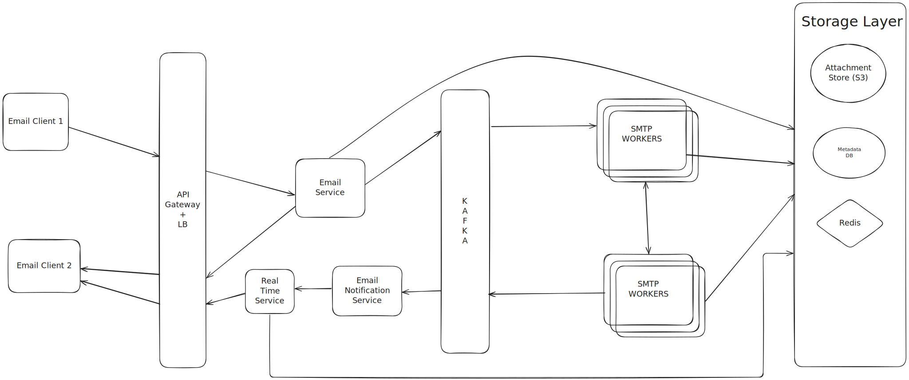

# Distributed Email Service

<p align="center">
  
</p>

## Metadata DB choice

The metadata DB design section explains how to store information about emails, rather than the email content itself. Here's a breakdown of the key points:

**Characteristics of email metadata:**

* Small and frequently accessed: Headers (sender, subject) are read often.
* Body size varies, infrequently accessed: The full email content is usually only read once.
* Recency matters: Users typically access recent emails more often.
* High reliability: Data loss is unacceptable.
* Choosing the right database: Given these characteristics, a NoSQL database is often preferred over a traditional relational database (SQL) for email metadata, especially at scale.

###Why NoSQL? 

Relational databases can struggle with large, unstructured data (like email bodies) and with the high input/output operations per second (IOPS) required for a massive email service. NoSQL databases, are designed for high scalability and availability, and can handle varying data sizes efficiently.

**First we try to understand what is Normalization and what is Denormalization**

## Metadata DB Design Deepdive

1. Normalization

	* **Goal:** Reduce data redundancy and improve data integrity.
	* **How it works:** It involves organizing database tables to minimize duplicate data. This is achieved by breaking down large tables into smaller, more focused tables and defining relationships between them using primary and foreign keys.

2. Denormalization

	* **Goal:** Improve query performance and simplify data access, often at the cost of introducing some data redundancy.
	* **How it works:** It's the inverse of normalization. Instead of strictly eliminating redundancy, denormalization intentionally adds controlled redundancy back into the database schema. This often means combining data from multiple normalized tables into a single, wider table, or duplicating certain columns across tables.
	
**Why Denormalization is useful for our system ?**

* **NoSQL Limitations:** NoSQL databases, like those often used for email metadata due to their scalability, don't handle complex joins as efficiently as relational databases. Joins are necessary to combine data from multiple tables to satisfy a query.
* **Performance Requirements:** Email systems require very fast response times, especially for common operations like viewing your inbox.
* **Specific Query Example:** The query to "Fetch all read or unread emails" would be slow if the email metadata was fully normalized. It would require scanning the emails_by_folder table and then joining it with another table to filter by read status.
* **Denormalization Solution:** To avoid the slow join, separate tables (read_emails and unread_emails) are created. These tables duplicate the email metadata, but they are pre-filtered by read status. This means the query can directly access the relevant table and retrieve the results very quickly, without any joins.


```
+----------------+       +-------------------+       +-----------------+
|   users        |       |   folders_by_user |       |   emails_by_folder|
+----------------+       +-------------------+       +-----------------+
| user_id (PK)   |-------| user_id (PK, FK)  |<------| user_id (PK, FK)|
| user_name      |       | folder_id (PK)    |       | folder_id (PK, FK)|
+----------------+       | folder_name       |       | email_id (PK)   |
                         +-------------------+       | from            |
                                                     | to              |
                                                     | subject         |
                                                     | preview         |
                                                     | is_read         |
                                                     +-----------------+
+-----------------+
|   read_emails   | (Denormalized)
+-----------------+
| user_id (PK)    |
| folder_id (PK)  |
| email_id (PK)   |
| from            |
| to              |
| subject         |
| preview         |
| is_read (True)  |
+-----------------+

+-------------------+
|   unread_emails   | (Denormalized)
+-------------------+
| user_id (PK)      |
| folder_id (PK)    |
| email_id (PK)     |
| from              |
| to                |
| subject           |
| preview           |
| is_read (False)   |
+-------------------+
```