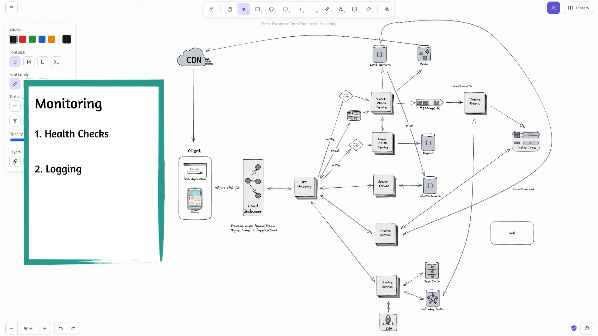

# Social Media

  

## Capacity Estimation

for a social network with 100 Million daily active users. 

Following pareto principle, i'll assume only 20% of daily active users are posting, and 80% of the daily active users are browsing their timeline feed

20M DAU for writing posts and 80M DAU for scrolling the timeline.

If we say that only 20% of users post per day and 1 user posts about 10 post in a day then there are 200Million posts per day which becomes 2k posts per second amd accounting for 10x as peak load my peak load now becomes 20k posts written per second.

At this scale, the system becomes write-heavy, and we need sharding and asynchronous processing via queues to handle bursty traffic and downstream fan-out safely.”

Out of 100M DAU, 80M users are readers. Assuming each opens the app 10 times a day, we get around 800M read requests per day, which is roughly 8K QPS on average and about 80K QPS at peak. Since the system is read-heavy, we rely heavily on caching, feed precomputation, and read replicas to serve reads efficiently.

At peak, we expect ~80K read QPS. Assuming an 80% cache hit rate, only ~16K QPS reaches the database, which is manageable with read replicas.