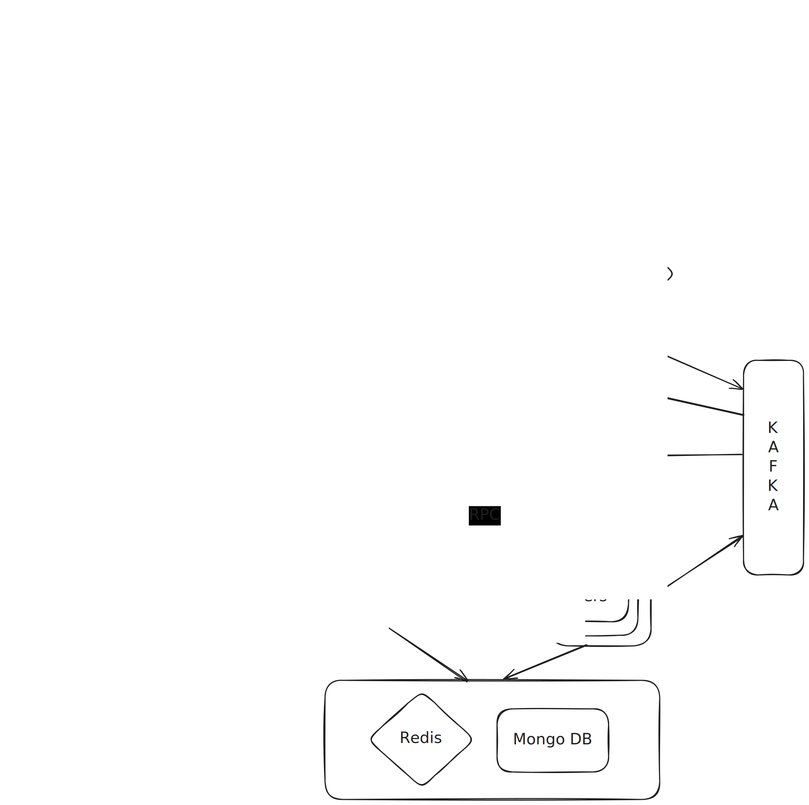

# Google Docs

<p align="center">
  
</p>

## File Upload and download Workflow

Similar to how [Dropbox](../dropbox/) design was discussed

## How to Represent Document Content?

**Why we can't use flat sequence of characters to represent document content ?**

1. No Structure: Fails to represent rich document hierarchy (paragraphs, headings, lists).
2. Fragile Formatting: Difficult to manage and apply rich text attributes (bold, color) as offsets change with edits.
3. Inefficient Complex Operations: Operations like moving entire sections or tables are cumbersome, requiring extensive re-calculation of offsets.
4. Challenging for Collaboration: Leads to complex conflict resolution and operation transformation issues due to constantly shifting character positions, making consistency difficult.

**Why a tree structure is used to represent document content ?**

1. Representing document content as a tree structure in collaborative editing systems like Google Docs is preferred because it:
2. Models Hierarchy: Naturally reflects the nested structure of documents (paragraphs, headings, lists).
3. Manages Rich Formatting: Allows attributes (like bold, color, alignment) to be easily attached to specific content nodes.
4. Enables Efficient Complex Operations: Simplifies operations like moving or deleting entire sections, tables, or paragraphs by manipulating whole nodes.
5. Enhances Collaboration Robustness: Provides stable reference points (nodes) for changes, which greatly aids conflict resolution in algorithms like Operational Transformation (OT) or CRDTs.

Following is an example of how a document content tree is represented.

```
[Document] (Root Node)
  |
  +-- [Paragraph] (Attributes: align="left", id="p123")
  |     |
  |     +-- [Text Span] (Content: "This is some ")
  |     +-- [Text Span] (Content: "bold text.", Attributes: bold=true)
  |     +-- [Text Span] (Content: " And ")
  |     +-- [Text Span] (Content: "italicized!", Attributes: italic=true)
  |     +-- [Text Span] (Content: ".")
  |
  +-- [Heading 1] (Content: "Introduction", Attributes: level=1, id="h456")
  |
  +-- [Paragraph] (Content: "Here's a list of items:", id="p789")
  |
  +-- [List] (Attributes: type="bullet", id="l101")
        |
        +-- [List Item] (Attributes: id="li202")
        |     |
        |     +-- [Paragraph] (Content: "First item.")
        |
        +-- [List Item] (Attributes: id="li303")
              |
              +-- [Paragraph] (Content: "Second item, with a ")
              +-- [Paragraph] (Content: "new line inside.")
```

## How does collaborative editing happen ?

let's walk through a real-time example of document editing with two users, focusing on how differential synchronization works with a tree representation.

1. Let's say our document initially looks like this (simplified tree):
	```
	[Document]
	  |
	  +-- [Paragraph_A] (id: pA)
	  |     +-- [Text_Span_1] (content: "Hello, ")
	  |     +-- [Text_Span_2] (content: "world!")
	  |
	  +-- [Paragraph_B] (id: pB)
			+-- [Text_Span_3] (content: "This is a ")
			+-- [Text_Span_4] (content: "sample.")
	```
	Both Client 1 (User A) and Client 2 (User B) start with this exact version of the document.

2. Client 1 (User A): User A types "big " before "world!" in Paragraph_A.

	* Local Application (Optimistic UI): Client 1 immediately updates its local display: "Hello, big world!"
	* Diff/Operation Generation: Client 1's synchronization logic compares its new local state to its last acknowledged state. It detects a change within Text_Span_2 of Paragraph_A.
	* It generates an Operation (Op): [Op_A_1] = { type: "insert", target_node_id: "Text_Span_2", position: 0, content: "big " }
	* Sending Op: Client 1 sends Op_A_1 to the Collaboration Server.

3. Simultaneously, Client 2(User B) decides to bold "sample" in Paragraph_B.

	* Local Application (Optimistic UI): Client 2 immediately updates its local display: "This is a sample."

	* Diff/Operation Generation: Client 2 generates an Op:
	```
	[Op_B_1] = { type: "apply_attribute", target_node_id: "Text_Span_4", attribute: { bold: true } }
	```
	* Sending Op: Client 2 sends Op_B_1 to the Collaboration Server.Simultaneously, User B decides to bold "sample" in Paragraph_B.

4. The Collaboration Server Op_A_1 and other Broadcasts

	* The server receives Op_A_1 from Client 1.

	* It applies Op_A_1 to its authoritative document tree. Text_Span_2 in Paragraph_A is updated to "big world!".

	* The server then broadcasts Op_A_1 to all other connected clients (in this case, Client 2).
	
5.  Client 2 Receives Op_A_1 (and Potentially Transforms its Own Pending Op)

	* Client 2 receives Op_A_1 from the server.

	* Crucial Step (Transformation for OT): Client 2 has a pending local change (Op_B_1) that it hasn't sent/received acknowledgement for yet. Since Op_A_1 affects Paragraph_A and Op_B_1 affects Paragraph_B, these operations are non-conflicting in terms of their target nodes. 
	
	Therefore, no complex transformation of Op_B_1 is strictly needed against Op_A_1 in this specific case, as they operate on different branches of the tree.

	* Application: Client 2 applies Op_A_1 to its local document tree. Its view updates to: "Hello, big world! This is a sample."

6. The collaborative server now receives Op_B_1 from client 2. It applies Op_B_1 to its authoritative document tree. and broadcasts the changes to all other nodes.

7. Client 1 receives Op_B_1 from the server and It applies Op_B_1 to its local document tree.


## Collaborative Editing workflow

1.  When a user makes an edit, their client application generates a small, atomic "operation" (diff). This operation is sent via WebSockets to a WebSocket Front-End (the "Collaboration Server"). This Front-End forwards the operation to a Worker Node.

	* When a user connects to a specific document (e.g., Doc_X), their connection will be routed by your Load Balancer to a particular WS_Frontend instance (e.g., WS_Frontend_2).
	* WS_Frontend_2 will then register this fact in a fast, distributed key-value store like Redis:
		* Key: document_id (e.g., Doc_X)
		* Value: WS_Frontend_ID (e.g., WS_Frontend_2_ID)
	* This mapping tells the system: "For Doc_X, send updates to WS_Frontend_2."

2. The Worker Node is the intelligence hub: it applies Operational Transformation (OT) or CRDTs to the operation to handle concurrent changes, updates the authoritative document tree in the Collaborative Document DB (e.g., MongoDB), and then publishes the processed operation to a Message Queue (e.g., Kafka).
	* When a Worker Node processes an operation for Doc_X and needs to broadcast it:
		* It first queries Redis to find out which WS_Frontend_ID (e.g., WS_Frontend_2_ID) is currently serving Doc_X.
		* Then, it constructs the message for Kafka, ensuring the WS_Frontend_ID is included in the message payload.
	* The Worker Node then publishes this message to a Kafka topic.

3. Targeted Consumption by WS_Frontends: All WS_Frontend instances still subscribe to the relevant Kafka topics (e.g., document_operations).
However, upon receiving a message, a WS_Frontend will filter it at the application level based on the WS_Frontend_ID in the message payload.
Only WS_Frontend_2 (in our example) will see a message destined for WS_Frontend_2_ID and then proceed to push it over its active WebSocket connections for Doc_X. 
Other WS_Frontends will discard it.

## Optimizing Communication between collaboration server and worker service.

An RPC (Remote Procedure Call) connection between the WebSocket Front-End (Collaboration Server) and the Worker Servers is needed for:

* Efficient Handoff: It allows the Front-End to quickly and directly pass individual client operations to a Worker for processing.
* Performance: RPC frameworks are optimized for low-latency, high-throughput inter-service communication, ensuring rapid processing of user edits.
* Structured Communication: It provides a clear, defined interface for communication, making the system more organized and easier to maintain.
* Load Distribution: Enables the Front-End to distribute incoming client operations across multiple Worker Servers efficiently.


## How trees are created and saved.

1. Document Tree Construction (On Upload):

	* Uploaded files (DOCX, PDF, etc.) are processed by an Ingestion Worker.
	* This worker parses the file's content and structure.
	* It then builds the internal, hierarchical tree representation of the document.
	* This initial authoritative tree is saved in the Collaborative Document DB (MongoDB).

2. Document Tree Saving & Persistence (During Collaboration):

	* MongoDB remains the live, authoritative store for the document tree, constantly updated by Worker Nodes.
	* All individual editing operations are logged in Kafka for history and replay.
	* S3 is used for static snapshots or archives of the document (e.g., exported DOCX/PDF files), not for the live, constantly changing document tree itself.

# Real-time Collaborative Editing: Operational Transformation (OT)

This section explains how Operational Transformation (OT) helps in handling conflicts in real-time collaborative editing systems.

## 1. How Does Operational Transformation (OT) Help in Handling Conflicts?

In real-time collaborative editing, a "conflict" doesn't usually mean two users trying to modify the exact same character at the exact same millisecond that leads to an unresolvable state. Instead, conflicts arise from **concurrent operations** and the need to apply them in a way that preserves the **intent** of all users, regardless of the order in which the server receives them.

### The Core Idea of OT:

OT is a set of algorithms that allows you to transform an operation (O_1) based on another operation (O_2) that has already been applied, so that O_1 can still 
be correctly applied to the document state that resulted from O_2. 
The goal is to ensure that all clients eventually converge to the same document state, while preserving the user's intended changes.

### How it Handles Conflicts (Intent Preservation & Convergence):

1.  **Concurrent Operations:** Imagine two users, Alice and Bob, start with document "ABC".
    * **Alice:** Inserts "X" at position 1. Her operation is O_A = `{Insert('X', 1)}`. Document becomes "AXBC".
    * **Bob:** Inserts "Y" at position 1. His operation is O_B = `{Insert('Y', 1)}`. Document becomes "AYBC".

2.  **Server's Role:**
    * The server receives O_A first. It applies O_A to its authoritative "ABC" document. Document is now "AXBC".
    * The server then receives O_B. If it naively applied O_B (Insert 'Y' at position 1) to "AXBC", the document would become "AYXBC". This isn't correct; Bob intended to insert 'Y' where 'A' originally was, so 'X' should be after 'Y'.
    * **This is where OT steps in.** The server takes O_B and *transforms* it against O_A.
        * Since O_A inserted a character *before* Bob's intended insertion point, O_B's position needs to be adjusted. The transformation function realizes that after "X" was inserted at position 1, Bob's original position 1 is now position 2.
        * So, the transformed operation becomes O_B2 = `{Insert('Y', 2)}`.
    * The server then applies O_B2 to "AXBC". Document becomes "AXYBC".

3.  **Client's Role (Reconciliation):**
    * Now, clients need to catch up. Alice already has "AXBC". Bob already has "AYBC" (his local, unacknowledged change).
    * The server broadcasts O_A and O_B2 to all clients.
    * When Alice's client receives O_B2, it applies it. `"AXBC" + O_B2 (Insert 'Y' at 2) = "AXYBC"`.
    * When Bob's client receives O_A, it *transforms its own pending operation* (O_B) against the incoming O_A. Just like the server, it realizes its `Insert('Y', 1)` needs to be transformed because `Insert('X', 1)` happened. The transformed O_B becomes "Y" at position 2 (after X). Then it applies O_A. `"AYBC" + O_A (Insert 'X' at 1) = "AXYBC"`. (The exact order of transformation and application can vary, but the outcome is convergent).

### Key Takeaways for Conflict Handling:

* **Intent Preservation:** OT aims to ensure that the *intent* of each user's operation is preserved, even when operations are interleaved.
* **Convergence:** All replicas of the document (on the server and all clients) eventually converge to the exact same state, guaranteeing consistency.
* **Atomic Operations:** Conflicts are managed at the level of small, atomic operations (like character insertions/deletions, attribute changes) rather than by locking entire document sections.