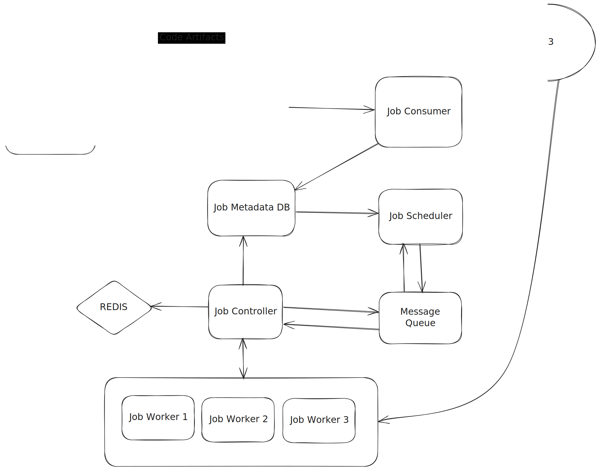

<p align="center">
  
</p>

## Capacity Estimation

Assuming 10 million unique jobs per day, the system handles about 100 job submissions per second on average and roughly 1,000 jobs per second at peak. This write volume can be comfortably handled by a relational database.

However, in a distributed job scheduler, each job generates multiple state transitions during its lifecycle, As a result, each job causes several durable writes, leading to write amplification. When these lifecycle writes are accounted for, the system performs several thousand writes per second at peak, making it a write-heavy system. Reads are comparatively fewer and often predictable.

Because job execution is asynchronous and jobs must not be lost, the system cannot rely on synchronous database polling. A durable queue is required to decouple job submission from job execution, handle bursty traffic, and ensure reliability.

## Database schema for Cassandra Database

```
CREATE TABLE scheduled_task (
    user_id UUID,
    task_id UUID,
    name text,
    schedule_cron text,
    artifact_id text,    id of the artifact stored in s3
    entrypoint text,
    PRIMARY KEY (user_id, task_id)
);

partition key : user_id 
All of a user's tasks live in the same partition → fast queries.

Clustering key = task_id
Uniquely identifies the task within that user.


CREATE TABLE scheduled_task_run (
    user_id UUID,
    task_id UUID,
    scheduled_at timestamp,
    run_id UUID,
    status text,
    PRIMARY KEY ((user_id, task_id), scheduled_at)
) WITH CLUSTERING ORDER BY (scheduled_at DESC);


Partition key = (user_id, task_id) : All runs for a single task are grouped together → great for history queries.
Clustering key: scheduled_at — allows querying “upcoming runs” efficiently:


scheduled_task         -- instead of job_type
scheduled_task_run     -- instead of job_run

```

Design Justifications for **Cassandra**

* Write-heavy workload: Every scheduled job run is an insert — Cassandra excels at high write throughput.
* Horizontal scaling: Each scheduler can handle a shard by task_id (partitioning is natural).
* No joins needed: All queries are by task_id and optionally scheduled_at.

## Series of Steps

**Step 0 — Job Submission**

Job consumer receives a new job request from Queue. Computes the scheduled_at time for a job and
Inserts into `job_type` and `job_run` tables

```
INSERT INTO job_type (name, schedule_cron, artifact_id, entrypoint)
VALUES ('customer_sync', '0 2 * * *', 'artifact-123', 'main:run');

INSERT INTO job_run (job_type_id, status, scheduled_at)
VALUES (1, 'queued', '2025-11-17T02:00:00Z');

```

✅ This represents the job template.

**Step 2 — Scheduler Tick / Polling**

Scheduler runs every few seconds:

```
SELECT *
FROM job_run
WHERE status = 'queued'
  AND scheduled_at <= NOW() + INTERVAL 'poll_threshold'
ORDER BY scheduled_at ASC
LIMIT 100;
```

Enqueues jobs into the Distributed Priority Queue (DPQ).
Updates job_run.status → enqueued.
Only the scheduler touches the DB; workers are decoupled.

**Step 3 — Controller / Dispatcher**

* The controller pulls jobs from Message Queue and assigns job to workers.
* Created a record in redis job_run_id : worker_id and also maintains a mapping between worker_id : assigned_job[job_id1, 2...]. this is done so that in an event of worker failure, the scheduler can assign jobs to some other worker
* Updates job_run.status in DB:
	* running when worker starts
	* success / failed when worker finishes
* On failure, controller can:
	* Re-enqueue the same job_run
	* Or create a new job_run with status='queued' and scheduled_at = NOW() + retry_interval
* Dead-letter jobs after exceeding max retries.
* If a recurring job finished executing, the Controller sends an api request to the scheduler so that it can create a new row in `job_run` table 

**Step 4- Worker**

Once a worker is assigned a job, it can pull artifact from the object storage and executed the artifact
and reports the job status to the controller so that controller can update the job run_table accordingly.

**Step 5 - Recurring Job Rescheduling**

After a recurring job runs successfully, the scheduler received an event from Message queue, and it calculates next execution from `job_type.schedule_cron` and Inserts new job_run row:

```
INSERT INTO job_run (job_type_id, status, scheduled_at)
VALUES (1, 'queued', '2025-11-18T02:00:00Z');
```

This ensures a rolling window of scheduled executions.


---

## Running Multiple Schedulers

Each scheduler instance is pinned to a shard/partition.

Scheduler polls only its shard/partition for due job_run rows.

Precomputes job_run rows for new job_type entries in its shard.

Enqueues jobs to the DPQ as usual.


## How does a scheduler know which cassandra key range to check ?

A scheduler instance discovers its shard by reading Cassandra’s token ring using the built-in driver metadata.
Cassandra already divides the keyspace into token ranges, so we evenly distribute those token ranges across all scheduler instances.
Each scheduler polls only the rows whose partition keys hash into its assigned token range using token(task_id) queries.
This gives deterministic, lock-free sharding and horizontal scalability.

The simple deterministic formula :

`range_index % scheduler_count == scheduler_id`

Let us suppose I have following token range and 3 scheduler instances running:

```
Cassandra Token ring

R0: -9223372036854775808 → -6917529027641081854
R1: -6917529027641081854 → -4611686018427387909
R2: -4611686018427387909 → -2305843009213693954
R3: -2305843009213693954 → 0
R4: 0 → 2305843009213693954
R5: 2305843009213693954 → 4611686018427387909
R6: 4611686018427387909 → 6917529027641081854
R7: 6917529027641081854 → 9223372036854775807


scheduler_count = 3
scheduler_ids = [0, 1, 2]

Scheduling Service 1 will handle those ranges where range_index % 3 == scheduling service id

```

## How will scheduling service know its id ?

Every scheduling service can register itself with a service registry (Zookeeper) which will assign it a service id.


## workers

We run workers as containers, Containers are similar to VMs in that they provide an isolated environment for running jobs, but they are much more lightweight and faster to start up. Let's break down the key differences between VMs and containers. We can reuse the same containers for multiple jobs, reducing resource usage and improving performance.

## Scaling the Controller 

Use a Queue That Supports Parallel Consumers
Best Option : Kafka (ideal at scale)

Why this matters?

A queue with consumer groups guarantees that:

 * Multiple controllers can read from the same topic/stream
 * Messages are load-balanced across controllers

You can increase throughput simply by Scaling controllers horizontally

Controllers are stateless. Workers register and heartbeat to a shared Controller Service endpoint. A load balancer spreads these requests across controller instances.

## If controller dies mid job ?

Workers send heartbeats through the Controller Service. If a worker stops heartbeating for a configured timeout, the Controller marks it as dead and looks up the list of active runs assigned to that worker (stored in Redis). Those runs are marked as lost or retry_pending in Cassandra, their tenant license tokens are released, and the jobs are re-enqueued back into the DPQ. This allows another healthy worker to pick them up immediately. If job-level heartbeats are implemented, we can also detect hung or stalled jobs even if the worker is still alive. This mechanism ensures fault tolerance, zero manual intervention, and keeps the system highly available.