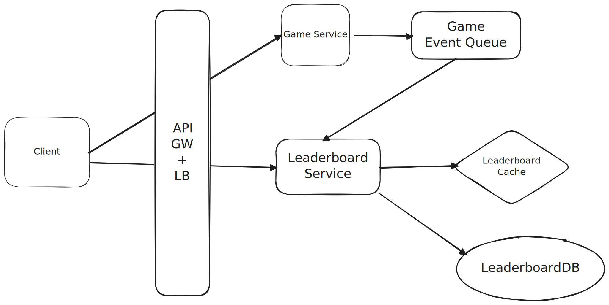

# Time based leaderboard

<p align="center">
  
</p>

Suppose I'm creating a service which will show me top videos watched in last K minutes, K hours, H days.

Following example elaborates upon how this can be done.

https://www.hellointerview.com/learn/system-design/problem-breakdowns/top-k

## Creating time based buckets

Every time someone watches a video, we get a view event like the following and we get **millions of these events**.

```
video_id = "A1"
timestamp = 2025-08-08 10:35
```

For each time range we want something like this

```
Last 1 hour

A1 → 2000 views
B5 → 1800 views
C9 → 1700 views

Last 1 day

B5 → 90,000 views
A1 → 85,000 views
```

Instead of storing one giant number for “last 1 hour,”
we store smaller buckets of counts, for example 1 bucket per minute.

We can have time buckets like this `Map<TimeStamp, Bucket> buckets`

And Each bucket looks like this.

```
class Bucket {
	HashMap<videoId, count> for quick counting.

	Min-Heap (priority queue) of size K to track the top videos.
}
```

Why both?

HashMap → O(1) updates to counts when a new watch comes in.
Heap → O(log K) to maintain the Top-K list.

Example: for 10:00, 10:01, 10:02 …

```
bucket[10:00]["A1"] = 35
bucket[10:00]["B5"] = 40
...
bucket[10:59]["A1"] = 27
```
And then we drop the older buckets

“Last 1 hour” → keep last 60 buckets only.

“Last 1 day” → keep last 1,440 buckets (24×60).

“Last 1 week” → keep last 10,080 buckets (7×24×60).

Old buckets get deleted automatically — so your counts stay fresh.

Now to query top K.
For last 1 minute -> just return heap from the current minute bucket
For last 1 hour → just return the heap from the current hour bucket.
For last 1 day → merge heaps from the last 24 buckets into a new heap, then take top K.
For last 1 week → same merging logic but with 7 days of buckets.

Note that the heap will not be bounded to K elements, whenever a new event comes up it will be added as a new object into the heap.
Now when we need the top k video ids, we will retrieve elements from the priority queue and discard video ids whose count in priority queue does not
match the accurate count in map. This is how we are doing deduplication.

```
Event e = new Event(videoId, viewCount);
PriorityQueue<Event> pq;
pq.push(e)
```

```
            Incoming Video Watch Events
                     |
             ┌────────────────┐
             |  Event Router   |
             └────────────────┘
                     |
       ┌─────────────┼───────────────┐
       |             |               |
  1-Hour Tracker  1-Day Tracker  1-Week Tracker
       |             |               |
   ┌───┴───┐     ┌───┴───┐       ┌───┴───┐
   |60 min |     |24 hour|       |7 day  |
   |buckets|     |buckets|       |buckets|
   └───┬───┘     └───┬───┘       └───┬───┘
       |             |               |
       ▼             ▼               ▼
  ┌──────────┐  ┌──────────┐   ┌──────────┐
  | Map:     |  | Map:     |   | Map:     |
  | videoId→ |  | videoId→ |   | videoId→ |
  | viewCnt  |  | viewCnt  |   | viewCnt  |
  └────┬─────┘  └────┬─────┘   └────┬─────┘
       |             |               |
  ┌────▼─────┐  ┌────▼─────┐   ┌────▼─────┐
  | Min-Heap |  | Min-Heap |   | Min-Heap |
  |  (Top K) |  |  (Top K) |   |  (Top K) |
  └──────────┘  └──────────┘   └──────────┘

When querying:
   - "Top-K in last 1 hour" → merge Top-K from 60 minute buckets
   - "Top-K in last 1 day" → merge Top-K from 24 hourly buckets
   - "Top-K in last 1 week" → merge Top-K from 7 daily buckets

```

✅ At YouTube scale — this approach is viable if:

Buckets are stored in-memory (Redis, RocksDB, or Java heap if small enough).

K is small (50–500).

Expiration is done lazily or on a schedule.

If you tried to calculate “Top-K” by running a SQL GROUP BY over all events in a time range each time, it would be thousands of times slower.

---

# Using a Cron and Flink Processing for near real time results

<p align="center">
  
</p>


Initially we start with a Top K service that reads from database, but that solution does not scale as it will take a lot of time to compute and serve the result.
SO we introduce a cache to decrease the latency. 
But now the data is only valid for some time and if we are requesting for a timestamp for which the data isn't calculated yet then again we will have to compute
and serve the results which is not very efficient and will lead to high latency.
Now to counter that we can add a cron to our system which, on fixed intervals, will precompute the top K for each time window and warms our cache in the same way. 
Then, requests that come to our top-K service are only reading from the cache, never querying the database.

## Optimising Writes

When millions of “view” events arrive per second (say every time someone watches a video),
if you write each event directly to the database, you’ll destroy your DB:
* Too many writes per second (each event = one row/insert).
* The DB becomes your bottleneck (high I/O, locking, cost).
* It doesn’t scale — you’ll quickly hit throughput limits.

**Solution**

Instead of sending every view to the DB:
* The system first groups events by (video_id, minute) — e.g. in a stream processor like Flink.
* It keeps a running count for that video within the current minute.
So, instead of writing 1 million separate rows like:

```
(video1, view)
(video1, view)
(video1, view)
...

```

It Just writes one row per hour

```
(video1, 10:05, total_views=1,000,000)

```

Flink handles checkpoint and recovery for us, so we don't have to worry about losing data or struggling with itchy problems like event delays.
For this Flink application, we'll use `BoundedOutOfOrdernessWatermarkStrategy` to handle late events: 
basically we'll tell Flink that we're ok waiting up to some time (probably 30 seconds here, < 1 minute) for late events to arrive. 
We'll also use a tumbling window of 1 hour to aggregate the views for each video.

Now, our Flink job is accepting individual view events and outputting sums of views per video on a 1 hour interval.
Because we're batching, instead of a steady stream of writes we now have a big lump of writes every hour. As long as these are spread across shards, this is acceptable and it can even be

## Optimising Top K Queries

If we only store hourly view counts, and someone wants to know the Top K videos for a month,
we’d have to add up 24 hours × 30 days = 720 rows for every video.
That’s a lot of work for the database — very slow.

* 💡 The idea

	Let’s also keep daily totals (and maybe monthly totals).

	That way:
	* To get the daily Top K → read 1 row per day.
	* To get the monthly Top K → add up 30 days instead of 720 hours.

    ✅ Much faster queries!

* ⚙ How to build those daily/monthly totals

	* **Option 1: Use a cron job**
		* Every hour or day, a background task sums up smaller chunks (e.g., hours → day).
		* It saves the result into a new “daily” table.
		* Now we will have tables like `video_views_hourly`, `video_views_daily`, `video_views_monthly`

	* **Option 2: Use Flink**
		* Tell Flink to also keep daily and monthly counts, not just hourly ones.
		* It will write those totals directly, no cron job needed.
		* It will write results into tables like `video_views_hourly`, `video_views_daily`, `video_views_monthly`
		
Pre-compute the aggregated counts for each window (hour/day/month) and store them in dedicated tables.

Instead of aggregating at query time, the system (Flink) aggregates every hour and writes updates to the window tables.
Top-K queries then simply perform:

```
SELECT videoId, views FROM VideoViewsLastHour ORDER BY views DESC LIMIT K;
```

This is instant because the table is small and indexed on views.

**Tradeoff**:
Writes become heavier (you update multiple window tables), but reads become extremely fast.

---

# Gaming Leader board

<p align="center">
  
</p>

## Capacity Estimation

for a leaderboard system, let's say there are 10M DAU and each user plays 10 games per day.
every time a game is finished a user score is submitted Leaderboard is opened to display top users and users rank.

100M games being played daily so score api is being called 100M times which means 10k QPS, with 10x as peak load factor, for score API

and similarly 10k QPS for leaderboards.

In this case read and writes seem to be balanced, but its actually the read path (get leaderboard and rank) that needs to be optimised so that we can get the leaderboard with minimum latency

---

We partition the leaderboard by leaderboard id, such that all the leaderboards go in in one shard.

1) suppose we need to add the score of user2 then we do :

```
ZADD leaderboard1 350 user2
```

this query means that we want to add score 350 to a user2 within leaderboard `leaderboard1`, where `leaderboard1` refers to the sorted set.

2) If we want to update the score then we use `ZINCRBY` in the follwing manner:

```
ZINCRBY leaderboard1 25 user2
```
this query means that we want to add score 25 to a user2 within leaderboard `leaderboard1`, where `leaderboard1` refers to the sorted set.

3) If a user wants to retrieve the score then:

```
ZSCORE leaderboard:{leaderboard1} user123
```

4) If a user wants to retrieve its rank then :

```
ZREVRANK leaderboard:{leaderboard1} user123
```

5) If a user wants to find k users above and below it then we can utilize `ZREVRANGE`.
	First we find the rank of user using `ZREVRANK` then we find the upper limit and lower limit to be used in `ZREVRANGE`	
```
user_rank = ZREVRANK leaderboard:{leaderboard1} user123

upper_limit = user_rank + k
lower_limit = max(0, user_rank - k)

ZREVRANGE leaderboard:{leaderboard1} lower_limit upper_limit WITHSCORES

```

to scale our system, we can shard the redis using leaderboardID such that all leaderboard related queries go to one redis instance, but then we need to find a way To
solve the HOT-LEADERBOARD problem.

## HOT LEADERBOARD PROBLEM

To solve hot leaderboard problem, we use a cassandra + redis approach where redis will maintain sorted set for TopK users while everything else remains inside cassandra.
Also cassandra acts as a source of truth in case Redis goes down. This is a write-thorugh and read-thorugh cache combination.

Write-through = Update db + cache together
Read thorugh = Cache first and then read from DB

Following will be the schema for cassandra

```
CREATE TABLE leaderboard_user_score (
    leaderboard_id text,
    user_id text,
    score bigint,
    updated_at timestamp,
    PRIMARY KEY ((leaderboard_id), user_id)
);

Partition id : leaderboard_id
Sort key : user_id

CREATE TABLE leaderboard_by_score_bucket (
    leaderboard_id text,
    bucket_id int,
    score bigint,
    user_id text,
    PRIMARY KEY ((leaderboard_id, bucket_id), score, user_id)
) WITH CLUSTERING ORDER BY (score DESC, user_id ASC);

Partition id : leaderboard_id, bucket_id
Sort key : score, user_id

where bucket_id = hash(user_id) % N 

N = total partitions

```

Now to calculate rank for a user that does not belong in the TopK cache, we need to retrieve it from Cassandra.
So following queries will be used

* Count users with higher score (rank computation)

  Sum counts across all buckets.
```
	For each bucket:

	SELECT COUNT(*)
	FROM leaderboard_by_score_bucket
	WHERE leaderboard_id = 'l1'
	  AND bucket_id = 7
	  AND score > 1850;
```

* Fetch K users above and below

	Repeat across buckets → merge → top K.
```
SELECT user_id, score
FROM leaderboard_by_score_bucket
WHERE leaderboard_id = 'l1'
  AND bucket_id = 7
  AND score > 1850
LIMIT k;

SELECT user_id, score
FROM leaderboard_by_score_bucket
WHERE leaderboard_id = 'l1'
  AND bucket_id = 7
  AND score < 1850
LIMIT 5;

```

Here we have partitioned the data to solve Hot-Leaderboard problem at database level.

## how to further optimize performance ?

we know that count() is expensive, so we pre-aggregated counter table

```
CREATE TABLE leaderboard_score_band_count (
    leaderboard_id text,
    score_band int,
    user_count counter,
    PRIMARY KEY ((leaderboard_id), score_band)
);


CREATE TABLE leaderboard_by_score_bucket (
    leaderboard_id text,
    bucket_id int,
	score_band int,
    score bigint,
    user_id text,
    PRIMARY KEY ((leaderboard_id, bucket_id), score, user_id)
) WITH CLUSTERING ORDER BY (score DESC, user_id ASC);

```

### What is a “score band”?

A score band is a coarse bucket of scores.

Example:
score_band = floor(score / 100)

```
| Score   | Band |
| ------- | ---- |
| 0–99    | 0    |
| 100–199 | 1    |
| 200–299 | 2    |
| …       | …    |
```

### What does the table store?

For each leaderboard:
```
(leaderboard_id, score_band) → number of users in that band

| leaderboard_id | score_band | user_count |
| -------------- | ---------- | ---------- |
| l1             | 25         | 1,243      |
| l1             | 26         | 987        |
| l1             | 27         | 412        |
```

### How this table is used (step by step)

* Step 1 : User wants their rank
  
  You already know: user's score and score band
  
  ```
  SELECT score, bucket_id FROM leaderboard_user_score WHERE leaderboard_id = 'l1' AND user_id = 'u123';
  ```
  
  we calculate the score and the score band in step 1

* Step 2 : Count users in higher score bands

  Instead of scanning millions of rows:
```
SELECT score_band, user_count FROM leaderboard_score_band_count WHERE leaderboard_id = 'l1' AND score_band > 21;

rank_above = SUM(user_count WHERE score_band > my_band)
```

* Step 3 : Rank inside the user’s band
```
users with score > my_score AND score_band = my_band

SELECT user_id FROM leaderboard_by_score_bucket WHERE leaderboard_id = 'l1' AND bucket_id = X AND score_band = my_band AND score > my_score;

we need to execute this query in all buckets

total_rows returned = rank of user within band
```

* Step 4 : Final Rank
```
rank = rank_above + rank_inside_band + 1
```