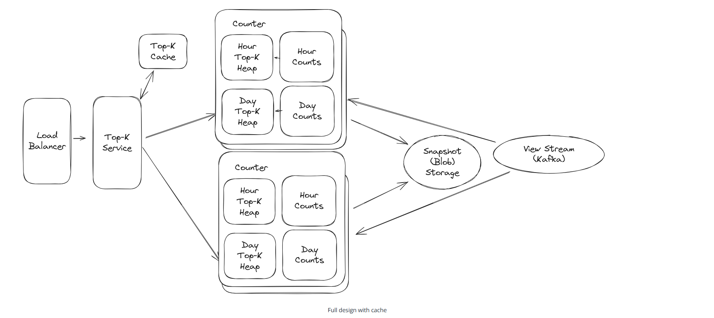
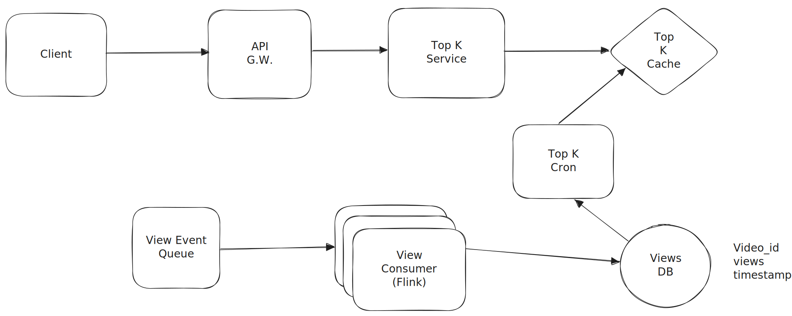

# Time based leaderboard

<p align="center">
  
</p>

Suppose I'm creating a service which will show me top videos watched in last K minutes, K hours, H days.

Following example elaborates upon how this can be done.

https://www.hellointerview.com/learn/system-design/problem-breakdowns/top-k

## Creating time based buckets

Every time someone watches a video, we get a view event like the following and we get **millions of these events**.

```
video_id = "A1"
timestamp = 2025-08-08 10:35
```

For each time range we want something like this

```
Last 1 hour

A1 → 2000 views
B5 → 1800 views
C9 → 1700 views

Last 1 day

B5 → 90,000 views
A1 → 85,000 views
```

Instead of storing one giant number for “last 1 hour,”
we store smaller buckets of counts, for example 1 bucket per minute.

We can have time buckets like this `Map<TimeStamp, Bucket> buckets`

And Each bucket looks like this.

```
class Bucket {
	HashMap<videoId, count> for quick counting.

	Min-Heap (priority queue) of size K to track the top videos.
}
```

Why both?

HashMap → O(1) updates to counts when a new watch comes in.
Heap → O(log K) to maintain the Top-K list.

Example: for 10:00, 10:01, 10:02 …

```
bucket[10:00]["A1"] = 35
bucket[10:00]["B5"] = 40
...
bucket[10:59]["A1"] = 27
```
And then we drop the older buckets

“Last 1 hour” → keep last 60 buckets only.

“Last 1 day” → keep last 1,440 buckets (24×60).

“Last 1 week” → keep last 10,080 buckets (7×24×60).

Old buckets get deleted automatically — so your counts stay fresh.

Now to query top K.
For last 1 minute -> just return heap from the current minute bucket
For last 1 hour → just return the heap from the current hour bucket.
For last 1 day → merge heaps from the last 24 buckets into a new heap, then take top K.
For last 1 week → same merging logic but with 7 days of buckets.

Note that the heap will not be bounded to K elements, whenever a new event comes up it will be added as a new object into the heap.
Now when we need the top k video ids, we will retrieve elements from the priority queue and discard video ids whose count in priority queue does not
match the accurate count in map. This is how we are doing deduplication.

```
Event e = new Event(videoId, viewCount);
PriorityQueue<Event> pq;
pq.push(e)
```

```
            Incoming Video Watch Events
                     |
             ┌────────────────┐
             |  Event Router   |
             └────────────────┘
                     |
       ┌─────────────┼───────────────┐
       |             |               |
  1-Hour Tracker  1-Day Tracker  1-Week Tracker
       |             |               |
   ┌───┴───┐     ┌───┴───┐       ┌───┴───┐
   |60 min |     |24 hour|       |7 day  |
   |buckets|     |buckets|       |buckets|
   └───┬───┘     └───┬───┘       └───┬───┘
       |             |               |
       ▼             ▼               ▼
  ┌──────────┐  ┌──────────┐   ┌──────────┐
  | Map:     |  | Map:     |   | Map:     |
  | videoId→ |  | videoId→ |   | videoId→ |
  | viewCnt  |  | viewCnt  |   | viewCnt  |
  └────┬─────┘  └────┬─────┘   └────┬─────┘
       |             |               |
  ┌────▼─────┐  ┌────▼─────┐   ┌────▼─────┐
  | Min-Heap |  | Min-Heap |   | Min-Heap |
  |  (Top K) |  |  (Top K) |   |  (Top K) |
  └──────────┘  └──────────┘   └──────────┘

When querying:
   - "Top-K in last 1 hour" → merge Top-K from 60 minute buckets
   - "Top-K in last 1 day" → merge Top-K from 24 hourly buckets
   - "Top-K in last 1 week" → merge Top-K from 7 daily buckets

```

✅ At YouTube scale — this approach is viable if:

Buckets are stored in-memory (Redis, RocksDB, or Java heap if small enough).

K is small (50–500).

Expiration is done lazily or on a schedule.

If you tried to calculate “Top-K” by running a SQL GROUP BY over all events in a time range each time, it would be thousands of times slower.

---

# Using a Cron and Flink Processing for near real time results

<p align="center">
  
</p>


Initially we start with a Top K service that reads from database, but that solution does not scale as it will take a lot of time to compute and serve the result.
SO we introduce a cache to decrease the latency. 
But now the data is only valid for some time and if we are requesting for a timestamp for which the data isn't calculated yet then again we will have to compute
and serve the results which is not very efficient and will lead to high latency.
Now to counter that we can add a cron to our system which, on fixed intervals, will precompute the top K for each time window and warms our cache in the same way. 
Then, requests that come to our top-K service are only reading from the cache, never querying the database.

## Optimising Writes

When millions of “view” events arrive per second (say every time someone watches a video),
if you write each event directly to the database, you’ll destroy your DB:
* Too many writes per second (each event = one row/insert).
* The DB becomes your bottleneck (high I/O, locking, cost).
* It doesn’t scale — you’ll quickly hit throughput limits.

**Solution**

Instead of sending every view to the DB:
* The system first groups events by (video_id, minute) — e.g. in a stream processor like Flink.
* It keeps a running count for that video within the current minute.
So, instead of writing 1 million separate rows like:

```
(video1, view)
(video1, view)
(video1, view)
...

```

It Just writes one row per hour

```
(video1, 10:05, total_views=1,000,000)

```

Flink handles checkpoint and recovery for us, so we don't have to worry about losing data or struggling with itchy problems like event delays.
For this Flink application, we'll use `BoundedOutOfOrdernessWatermarkStrategy` to handle late events: 
basically we'll tell Flink that we're ok waiting up to some time (probably 30 seconds here, < 1 minute) for late events to arrive. 
We'll also use a tumbling window of 1 hour to aggregate the views for each video.

Now, our Flink job is accepting individual view events and outputting sums of views per video on a 1 hour interval.
Because we're batching, instead of a steady stream of writes we now have a big lump of writes every hour. As long as these are spread across shards, this is acceptable and it can even be

## Optimising Top K Queries

If we only store hourly view counts, and someone wants to know the Top K videos for a month,
we’d have to add up 24 hours × 30 days = 720 rows for every video.
That’s a lot of work for the database — very slow.

* 💡 The idea

	Let’s also keep daily totals (and maybe monthly totals).

	That way:
	* To get the daily Top K → read 1 row per day.
	* To get the monthly Top K → add up 30 days instead of 720 hours.

✅ Much faster queries!

* ⚙ How to build those daily/monthly totals

* *Option 1: Use a cron job*
 * Every hour or day, a background task sums up smaller chunks (e.g., hours → day).
 * It saves the result into a new “daily” table.

* *Option 2: Use Flink*

Tell Flink to also keep daily and monthly counts, not just hourly ones.

It will write those totals directly, no cron job needed.