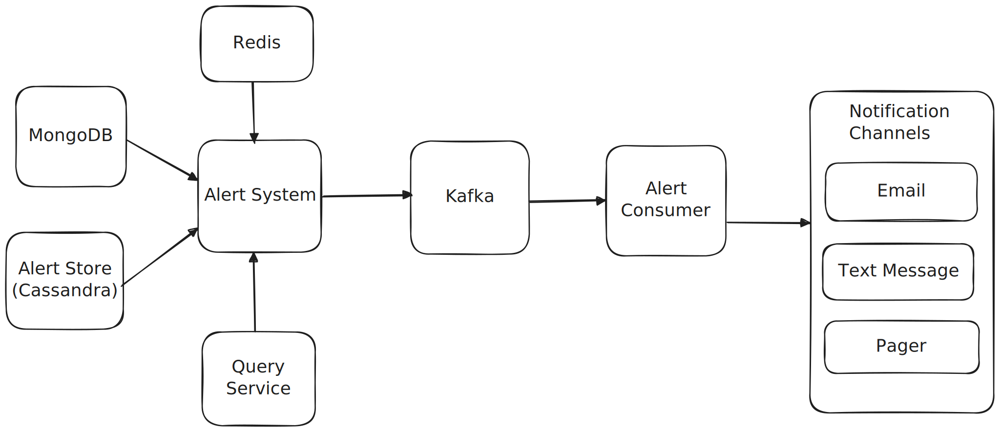

# Logging and Monitoring System

Only a couple of things will be discussed.

## Capacity Estimation

Capacity Estimation Summary
Assumptions

1,000 server pools

100 servers per pool

Total servers = 100,000

Each server emits 100 metrics

Metrics emitted every 10 seconds

Peak factor = 2×

Metric size = 1 KB

10 Million metric emitted by our server pools.

metrics are emitted per 10sec so 1M metric per second and it peak it becomes 2M metric per second

This means that data storage grows by ~200PB per day.

* Key Inferences
	* This is an extremely write-heavy system
	* Storage efficiency is critical
	  
	  Compression and DOwnsampling is important

## Metrics Collections

There are two approaches to metrics collection, push and pull.

### Push Model

We have a cluster of services, which have a metrics collection agent software installed on every cluster.
Which periodically aggregate metrics on their respective clusters and forward that information to metrics collection
service. The metrics collections service, aggregates this information and stores it into timeseries DB like influx

### Pull Model

In pull model, the metrics collector pulls metric data via pre defined HTTP endpoint */metrics*
Since servers, are added/removed frequently, we need to make sure that our metrics collector is aware of these developments,
and does not miss out on any information. To do that we use zookeeper service discovery.
Every cluster from which we seek information, registers itself with zookeeper. The metrics collector service queries zookeeper
to fetch all available services and using */metrics* https endpoint, it fetches metric information from them.  

## Alerting system

**Justification for using MongoDB**

* Flexible Schema: Easily adapts to evolving and varied rule structures.
* Nested Data: Naturally stores complex, hierarchical rule definitions.
* Fast Retrieval: Optimized for fetching entire rule documents quickly.