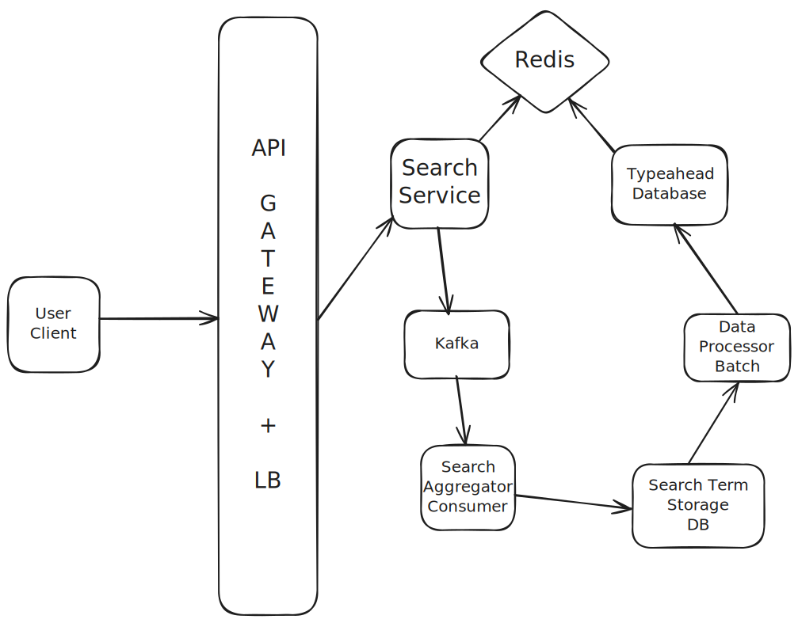

# Typeahead System

## Capacity estimation

Scale requirements:

*	`100 million daily active users`.
*	Each user makes `20 queries a day.` 
*	Search data should be updated daily

A new request is made every time a user types in a new character. 
Assuming the average number of characters of a query is 10, then the number of requests per query is 10 * average searches daily per user of 20 = `200 queries/user/day`.

`100M DAU X 20 Search Queries per day per user = 2 Billion Search Queries Per Day`

### Read Estimations

We have assumed that every search query has on an average 10 Characters
Then total Queries per year becomes `20Billions searches per year`

**20 Billion / 100000 seconds = ~200K QPS**

Assuming peak traffic is twice then query per second becomes **400 QPS**

### Storage

We have assumed that every search query has on an average 10 Characters and every character is suppose 2 Bytes.


Then daily storage requirement becomes:  **2 Billion Search Queries Per Day x 10 x 2Bytes = 40GB**
	
`2 Billion x 10 x 2Bytes = 40 GB per day` 

`For a year it will be ~13K GB = ~13TB`

## API Design

We just need one API in our system

`GET /suggestions?q={search-term}`

Response should include a list of suggested terms, ordered by relevance:

```
{
    "suggestions": ["suggestion1", "suggestion2", ..., "suggestionn"]
}
```

## Work Flow

<p align="center">
  
</p>

* The client sends an HTTP request to the GET `/suggestions` interface to start a query
* The load balancer distributes the request to a search service;
* The search service queries the index stored in the cache;
* The search service queries the database if data satisfying the query is not found in the cache;
* The search service also sends the search terms to a message queue which is consumed by a Search Aggregator Service.
* The Search Aggregator service stores the search terms in the Database.
* The Data Processor Batch pulls the daily data out of the search terms database and updates the index in the database as well as the cache.

## The choice of Index

**TRIE Datastructure**

In a Trie (prefix tree), each node represents a character, and a path from the root to a node represents a prefix.
Every nodes' descendants are top-k most likely prefixes.

In the context of the typeahead system, each node in the Trie could represent a character of a word. So, a path from the root to a node gives us a word in the dictionary. The end of a word is marked by an end of word flag, letting us know that a path from the root to this node corresponds to a complete, valid word. The time complexity to get to a node is O(log(length of prefix)).

The frequency of the words are stored in the node themselves. To find the top results, we can find all the nodes in the subtree and sort them by the frequency.

```
(root)
 ├── t
 │   └── o  (word: "to")
 │   └── e
 │       ├── a  (word: "tea")
 │       └── n  (word: "ten")
 └── i
     └── n  (word: "in")
         └── n  (word: "inn")

```
Trie that stores the words: "to", "tea", "ten", "in", "inn".

**Inverted Indexes**

An inverted index is a data structure used to create a full-text search. In an inverted index, there is a record for each term or word, which contains a list of documents that this term appears in. This approach is used by most full-text search frameworks such as Elasticsearch.

In the context of the typeahead system, we could store all the prefixes of a word, along with the word itself, in the inverted index. The search operation would then retrieve the list of words corresponding to a given prefix.

Here is how the Inverted Index would look:

```
{
    "c": ["car", "cat"],
    "ca": ["car", "cat"],
    "car": ["car"],
    "cat": ["cat"],
    "d": ["dog"],
    "do": ["dog"],
    "dog": ["dog"]
}
```

**So what to choose for indexes ?** 

Using Tries as indexes has some cons:

1. It doesn't support Fuzzy searching.
2. Handling multi-word phrases or completions like "new york" becomes much more complicated.
3. Scalability Issue: Modifying or deleting words in a large Trie can be complex, and sharding a Trie across multiple servers is generally challenging.

Advantages of Inverted Indexes for Typeahead:

1. Inverted indexes are the backbone of full-text search engines (like Elasticsearch, Solr) precisely because they are highly scalable.
2. Inverted indexes excel at handling queries with multiple words and can easily find suggestions that contain specific phrases.
3. Modern inverted index systems (like Lucene/Elasticsearch) have built-in capabilities for fuzzy searching. This means they can suggest "apple" even if the user types "aple" or "apples".
4. Ranking and Relevance: This is where inverted indexes truly shine for typeahead. Each "term" in the index (which could be a prefix or a full suggestion) can be associated with rich metadata:

Frequency: How often the term has been searched.

Recency: When it was last popular.

Context: What categories or types of products it belongs to.

Click-through rates: How often users clicked on a suggestion after typing a certain prefix.

This metadata allows for sophisticated ranking algorithms (e.g., TF-IDF, BM25, or custom algorithms combining various signals) to provide the most relevant suggestions, not just alphabetically ordered ones.

## File Upload Workflow

1. Client-Side File Preparation (User Device):

	* The User selects a file for upload.
	* The User Device application chunks the file into smaller, fixed-size blocks (e.g., 4MB).
	* For each block, the User Device computes a cryptographic hash (e.g., SHA-256) of its content.
	
2. Initiate Upload Session & Request Block Status (User Device to File Service via REST, then File Service to Block Service via RPC):

	* The User Device sends an initial POST `/files/upload/init` REST request to the File Service, including the file's logical metadata (filename, total size, parent folder ID) and a list of all block hashes and their sizes.
	* The File Service receives this, then makes an RPC call (e.g., BlockService.GetOrCreateBlockLocations) to the Block Service, passing the list of block hashes and sizes.
	
3. Block De-duplication & Presigned URL Generation (Block Service):

	* For each hash in the received list, the Block Service queries its Block MetaData DB (e.g., DynamoDB/Cassandra using the hash as a key).
	* If the hash exists: The Block Service notes that this block is already stored and retrieves its existing `physical_block_id` and `S3_location`.
	* If the hash does not exist: This is a new, unique block. The Block Service:
		* Generates a new `physical_block_id` (often derived from the hash).
		* Requests a `presignedUploadUrl` from S3 for this new block.
		* Stores the new block's metadata (`hash, physical_block_id, S3 location`) in the Block MetaData DB.
	* The Block Service compiles a response indicating which blocks already exist and which require upload (providing presignedUploadUrl for the new ones).
	
4. Once the file service receives a response from the block service, it then compiles all the information received from the Block Service and sends a response to the user device.

5. Once the user device receives response from the file service, it starts to iterate through it's file chunks, identifies those chunks for which it has received a `preSignedUrl` and uploads those chunks directly to S3 storage.

6. Once the chunks have successfully uploaded, the S3 can trigger an event notification which will update the file related information in the `metadata db`.

## File Download Workflow

1. Initiate Download Request (User Device to File Service via REST):
	* The User Device sends a `GET /files/download/{fileId}` REST request to the File Service.

2. Retrieve File and Block Metadata (File Service to MetaData DB/Redis, then File Service to Block Service via RPC):

	* The File Service first attempts to retrieve the file's logical metadata (including its ordered list of `physical_block_ids`) from File MetaData DB.
	* Then, for each `physical_block_id` in the file's list, the File Service makes an RPC call (e.g., BlockService.GetBlockDownloadUrls) to the Block Service.

3. Generate Presigned Download URLs (Block Service):

	* The Block Service queries its Block MetaData DB using the `physical_block_id` to get the block's S3_location.
	* It then requests a `presignedDownloadUrl` from S3 for that specific block.

4. Download Instructions to Client (Block Service to File Service via RPC, then File Service to User Device via REST):

	* The Block Service returns the list of `presignedDownloadUrls` (via RPC) to the File Service.
	* The File Service sends this list (via REST response) back to the User Device.

5. Direct Block Download from S3 (User Device to S3):

	* The User Device uses the received `presignedDownloadUrls` to directly download all the raw block data from S3.

6. File Reconstruction (User Device):

	* The User Device reassembles the downloaded blocks in the correct order to reconstruct the complete file.

## File Sync Workflow

1. Change Detection: Both the User Device and the cloud system constantly monitor for changes (new, modified, deleted, renamed files).

2. Client-Side Sync: When a user makes a local change:

	* The User Device chunks and hashes the file.
	* It asks the File Service to initiate an upload with these hashes.
	* The File Service (using the Block Service) de-duplicates blocks, getting `presignedUploadUrls` only for new blocks.
	* The User Device uploads only these new blocks directly to S3.
	* The File Service updates its metadata, potentially detecting and resolving conflicts (e.g., creating a conflict copy if the cloud version is newer).

3. Cloud-to-Client Sync: When a change occurs in the cloud (e.g., from another device):

	* A Notification Service alerts other User Devices about the change.
	* The User Device requests the changes from the File Service.
	* The File Service provides presignedDownloadUrls for any new/modified blocks.
	* The User Device downloads these blocks directly from S3 and applies the changes to its local file system (e.g., overwriting, deleting, recreating files).

## Notification Service

When a device comes online after being offline for a significant period, it needs a way to catch up on all changes that happened while it was disconnected.

* It immediately establishes a long polling connection with the Notification Service, providing its `lastSyncTime`. This connection is designed to quickly trigger a Cloud-to-Local Sync if any changes have occurred since that `lastSyncTime`. The Notification Service acts as a consumer of event coming from the Message Queue for which FileService is a producer. 

* While the long polling connection is active and if the notification service comes across a recent event related to the user id associated with the device, then it will send a signal to the user device to trigger a sync. if a long polling connection times out, the Notification Service will implicitly signal the User Device to proceed with a full sync.

* The device is now online and has potentially caught up (or is in the process of catching up), It then establishes a persistent WebSocket connection with the Notification Service.

When a User Device establishes a connection (either a Long Polling request or a WebSocket):

The Notification Service associates the incoming connection's socket/connection ID with the User ID (and potentially a Device ID) that authenticated the connection.
It stores this mapping in an efficient, concurrent data structure (e.g., a hash map or dictionary).

`Map<UserId, Map<DeviceId, ConnectionId>>`

`Map<ConnectionId, UserSessionDetails> (which includes UserId, DeviceId, lastSyncTime, and the actual socket object/handle)`.


## Why RPC connection between block service and File Service ?

The File Service and Block Service are considered internal, core components of the distributed system. 
They are not exposed directly to external clients (like User Devices). 
In such tightly integrated microservices, RPC simplifies communication

RPC frameworks often use more efficient binary serialization formats (like Protocol Buffers, Apache Thrift, gRPC) 
compared to text-based formats like JSON or XML used in REST. This results in smaller message sizes and faster parsing.

# Databases

FileVersions is a join table. The FileVersions table will have multiple rows for a single file_version_id:

* Each row in the FileVersions table represents one specific block that belongs to a particular file_version_id.

* The block_hash in each of these rows is indeed a foreign key referencing the Blocks table, which holds the actual information about that individual block.

* The block_sequence_index in FileVersions is crucial, as it defines the order of these blocks for that specific file version.

```
+---------------------------------+        +-----------------------------+
|        File MetaData DB         |        |      Block MetaData DB      |
+---------------------------------+        +-----------------------------+
|             Folders             |        |           Blocks            |
+---------------------------------+        +-----------------------------+
| - folder_id (PK)                |<-------|- block_hash (PK)             |
| - parent_folder_id (FK)         |        | - s3_location               |
| - name                          |        | - reference_count (INT)     |
+---------------------------------+        | - size_bytes                |
         |                             ^    +-----------------------------+
         | contains                  | logical_blocks_mapped_to
         V                             |
+---------------------------------+      +-----------------------------+
|             Files               |<-----|         FileVersions      |
+---------------------------------+      | (or FileBlockMapping)       |
| - file_id (PK)                  |      +-----------------------------+
| - user_id (FK)                  |      | - file_version_id (PK)      |
| - parent_folder_id (FK)         |      | - file_id (FK)              |
| - name                          |      | - block_hash (FK)           |
| - current_version_id (FK)       |      | - block_sequence_index (INT)|
| - size_bytes                    |      | - version_timestamp         |
| - status (e.g., 'uploaded', 'pending')|  +-----------------------------+
+---------------------------------+
         |
         | owns
         V
+---------------------------------+
|         UserDevices             |
+---------------------------------+
| - device_id (PK)                |
| - user_id (FK)                  |
| - last_sync_time (TIMESTAMP)    |
+---------------------------------+
```