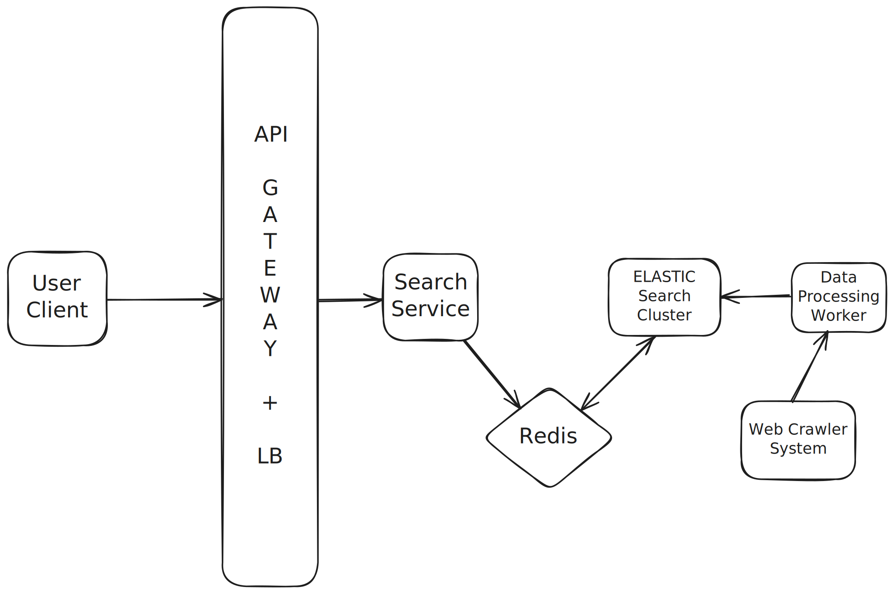

# Typeahead System

## Capacity estimation

I am designing a typeahead (autocomplete) system with 10 million daily active users (DAU).
If each user performs 10 searches per day, the system handles approximately 100 million searches per day.

Typeahead suggestions are fetched on every keystroke, which means there is one API call per character typed.
Assuming that each search contains 2 words on average, each word has 5 characters, and each character is 1 byte, a single search consists of 10 characters.

This results in 10 API calls per search, leading to a total of 1 billion suggestion fetch requests per day.
That translates to roughly 10K requests per second on average, and 100K requests per second at peak, assuming a 10× peak load factor.

Now, assuming that only 20% of searches result in unique words, about 20 million searches per day contribute new vocabulary.
Since each search has 2 words on average, the system ingests 40 million unique words per day.
At 5 characters per word, this corresponds to 200 million characters per day, or approximately 200 MB of storage growth per day, which is about 80 GB per year.

This amount of data can be comfortably stored in a partitioned and replicated persistent database.
However, given the high read throughput of up to 100K suggestion requests per second and the need for very low latency, serving suggestions directly from disk-backed storage is not sufficient.

To meet latency requirements, the system must rely on in-memory indexes.
This naturally leads to using Trie-based in-memory data structures, which are well suited for efficient prefix lookups and can serve autocomplete suggestions with minimal latency.

Why this is strong for interviews

Numbers are c

## Interpretation

I have about ~100K queries per second and about ~80GB storage requirement per year so what this means is that
I'm dealing with a read heavy system and storage is very modest and not bottlenect. I need low latency and high throughput.

Once I see that scale, potentially hundreds of thousands of lookups per second, each needing to return results within tens of milliseconds, that tells me:
I cannot rely on a traditional relational database for every keystroke. The query latency and connection overhead would be too high.
Instead, I should use a high-throughput, low-latency store — like Redis, ElasticSearch, or a custom in-memory trie or prefix index.
	

## API Design

We just need one API in our system

`GET /suggestions?q={search-term}`

Response should include a list of suggested terms, ordered by relevance:

```
{
    "suggestions": ["suggestion1", "suggestion2", ..., "suggestionn"]
}
```

## Work Flow

<p align="center">
  
</p>

* The client sends an HTTP request to the GET `/suggestions` interface to start a query
* The load balancer distributes the request to a search service;
* The search service queries the index stored in the cache;
* The search service queries the database if data satisfying the query is not found in the cache;
* The search service also sends the search terms to a message queue which is consumed by a Search Aggregator Service.
* The Search Aggregator service stores the search terms in the Database.
* The Data Processor Batch pulls the daily data out of the search terms database and updates the index in the database as well as the cache.
* The Aggregator Store can be a K-V store like cassandra or dynamodb

In this design, I haven't taken into account how the seeding of my search term storage DB will take place.

There will be improvements in the design that I will cover.

## The choice of Index

**TRIE Datastructure**

In a Trie (prefix tree), each node represents a character, and a path from the root to a node represents a prefix.
Every nodes' descendants are top-k most likely prefixes.

In the context of the typeahead system, each node in the Trie could represent a character of a word. So, a path from the root to a node gives us a word in the dictionary. The end of a word is marked by an end of word flag, letting us know that a path from the root to this node corresponds to a complete, valid word. The time complexity to get to a node is O(log(length of prefix)).

The frequency of the words are stored in the node themselves. To find the top results, we can find all the nodes in the subtree and sort them by the frequency.

```
(root)
 ├── t
 │   └── o  (word: "to")
 │   └── e
 │       ├── a  (word: "tea")
 │       └── n  (word: "ten")
 └── i
     └── n  (word: "in")
         └── n  (word: "inn")

```
Trie that stores the words: "to", "tea", "ten", "in", "inn".

**Inverted Indexes**

An inverted index is a data structure used to create a full-text search. In an inverted index, there is a record for each term or word, which contains a list of documents that this term appears in. This approach is used by most full-text search frameworks such as Elasticsearch.

In the context of the typeahead system, we could store all the prefixes of a word, along with the word itself, in the inverted index. The search operation would then retrieve the list of words corresponding to a given prefix.

Here is how the Inverted Index would look:

```
{
    "c": ["car", "cat"],
    "ca": ["car", "cat"],
    "car": ["car"],
    "cat": ["cat"],
    "d": ["dog"],
    "do": ["dog"],
    "dog": ["dog"]
}
```

**So what to choose for indexes ?** 

Using Tries as indexes has some cons:

1. It doesn't support Fuzzy searching.
2. Handling multi-word phrases or completions like "new york" becomes much more complicated.
3. Scalability Issue: Modifying or deleting words in a large Trie can be complex, and sharding a Trie across multiple servers is generally challenging.

Advantages of Inverted Indexes for Typeahead:

1. Inverted indexes are the backbone of full-text search engines (like Elasticsearch, Solr) precisely because they are highly scalable.
2. Inverted indexes excel at handling queries with multiple words and can easily find suggestions that contain specific phrases.
3. Modern inverted index systems (like Lucene/Elasticsearch) have built-in capabilities for fuzzy searching. This means they can suggest "apple" even if the user types "aple" or "apples".
4. Ranking and Relevance: This is where inverted indexes truly shine for typeahead. Each "term" in the index (which could be a prefix or a full suggestion) can be associated with rich metadata:

Frequency: How often the term has been searched.

Recency: When it was last popular.

Context: What categories or types of products it belongs to.

Click-through rates: How often users clicked on a suggestion after typing a certain prefix.

This metadata allows for sophisticated ranking algorithms like TF-IDF (Term Frequency-Inverse Document Frequency), BM25 (Best Matching 25), or custom algorithms combining various signals) to provide the most relevant suggestions, not just alphabetically ordered ones.

## Improved Design

<p align="center">
  
</p>

* The client sends an HTTP request to the GET `/suggestions` interface to start a query
* The load balancer distributes the request to a search service;
* The search service queries the index stored in the cache.
* We have implemented read through cache. If the data is not in the cache (a cache miss), the cache itself (or the caching layer/library) is responsible for fetching the data from the primary data store (Elasticsearch), storing it in the cache, and then returning it to the search service.
* The crawler's job is to systematically visit web pages, follow links, and download their content (HTML, plain text, etc.). It acts as the initial data collector.
* Data Processing / ETL Pipeline: This is a crucial stage where the raw, often messy, crawled data is transformed (Remove HTML tags etc) and N-Grams are generated for every word identified. This information is then passed on to the Elasticsearch cluster.

For the cache eviction, we use a combination of LRU + TTL. LRU handles capacity limits based on usage, while TTL ensures data freshness and prevents permanently caching stale or old suggestions.

The ElasticSearch cluster handles the storage, replication, and indexing of this data.

* Durability: Elasticsearch writes data to disk (using Lucene segments) and employs a transaction log (translog) to ensure data durability and recoverability even in case of node failures.
* Replication: Data is replicated across multiple nodes in an Elasticsearch cluster. If one node fails, replicas on other nodes ensure the data remains available.


I used a web crawler for seeding my elactic search cluster. On a day to day basis, many events happen all over the world which might potentially generate some new and popular search terms and trends. The web crawler, scrapes the internet and keeps our typeahead system fresh and highly responsive to real-world events and trending topics.

## Problem

There is no existing solution that utilizes Trie based approach for search suggestions. rather what's actually utilized is a prefix based index with fast top k suggestions retrieval.

Which can easily be obtained using redis sorted sets, where each prefix term is a sorted set and for each sorted set we will have search suggestions in sorted order