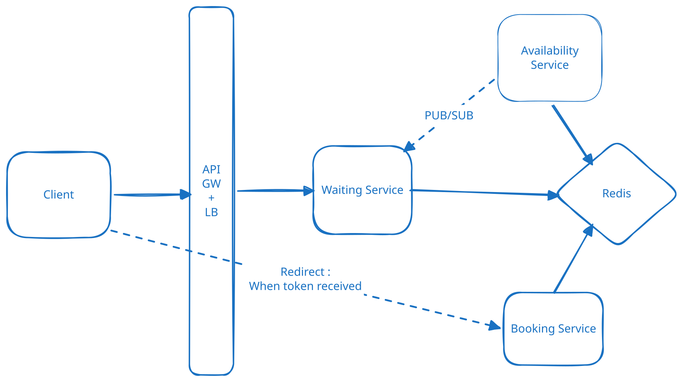

# Virtual Waiting Queue — High-Level System Design



A virtual waiting room protects a high-traffic booking system when millions of users attempt to book a limited number of tickets/seats simultaneously.

For example:

- 5 million users arrive at 10:00 AM
- Only 50,000 tickets are available
- Booking Service can safely handle only a few thousand concurrent users

Instead of sending all users directly to the Booking Service, we place a **Waiting Room** in front of it and gradually admit users.

---

## 1. Core Idea

```text
Millions of Users
       |
       v
 Waiting Room
       |
       | Controlled admission
       v
 Booking Service
       |
       v
 Seat Inventory
```

The Waiting Room acts as a **traffic-shaping layer**.

It absorbs the massive spike and releases users at a rate that the downstream booking system can safely handle.

---

# 2. Components

The main components are:

1. **Client / Browser**
2. **Load Balancer**
3. **Waiting Room Service**
4. **Redis**
5. **Admission Service**
6. **Booking Service**
7. **Seat Inventory DB**

---

# 3. Final Architecture

```text
                         +----------------+
                         |     Users      |
                         |    Millions    |
                         +-------+--------+
                                 |
                                 v
                         +---------------+
                         | Load Balancer |
                         +-------+-------+
                                 |
                                 v
                    +-------------------------+
                    |   Waiting Room Service  |
                    |                         |
                    | - Join Queue            |
                    | - Check Status          |
                    | - SSE Notifications     |
                    +-----------+-------------+
                                |
                                v
                     +---------------------+
                     |       Redis         |
                     |                     |
                     | Sorted Set          |
                     |  Waiting Queue      |
                     |                     |
                     | User State          |
                     |  WAITING / ADMITTED |
                     |  Admission Token    |
                     +----------+----------+
                                |
                                |
                         Users admitted
                                |
                                v
                     +---------------------+
                     |  Admission Service  |
                     |                     |
                     | Controls admission  |
                     | rate/capacity       |
                     +----------+----------+
                                |
                                v
                     +---------------------+
                     |   Booking Service   |
                     |                     |
                     | Seat Selection      |
                     | Reservation         |
                     | Payment             |
                     +----------+----------+
                                |
                                v
                     +---------------------+
                     |   Seat Inventory    |
                     |         DB          |
                     +---------------------+
```

---

# 4. Redis Sorted Set — The Queue

The waiting queue can be implemented using a Redis **Sorted Set (ZSET)**.

Conceptually:

```text
Redis ZSET: event:123:queue

+---------+---------+
| User    | Score   |
+---------+---------+
| user-A  | 100001  |
| user-B  | 100002  |
| user-C  | 100003  |
| user-D  | 100004  |
| ...     | ...     |
+---------+---------+
```

The **score determines the ordering**.

Users are therefore processed in queue order.

The score can be based on a server-generated monotonically increasing sequence or a sufficiently precise timestamp combined with a tie-breaker.

For example:

```text
User A joins → 100001
User B joins → 100002
User C joins → 100003
```

The important requirement is that generating the ordering must be **atomic**, so two users don't receive the same position.

---

# 5. APIs

## 5.1 Join Queue

```http
POST /events/{eventId}/queue
```

The user enters the waiting room.

Example response:

```json
{
  "queueId": "abc123",
  "status": "WAITING"
}
```

The user is added to the Redis Sorted Set.

---

## 5.2 Get Queue Status

```http
GET /events/{eventId}/queue/status
```

Example response while waiting:

```json
{
  "status": "WAITING",
  "position": 382451
}
```

After admission:

```json
{
  "status": "ADMITTED",
  "bookingUrl": "/events/123/booking",
  "expiresAt": "10:15:00"
}
```

This API is particularly important when a user disconnects from the waiting room.

---

## 5.3 SSE Connection

```http
GET /events/{eventId}/queue/stream
```

The browser maintains an SSE connection with the Waiting Room Service.

```text
Browser
   |
   | SSE connection
   |
   v
Waiting Room Service
```

When the user is admitted:

```text
Waiting Room Service
        |
        | SSE
        v
Browser

EVENT: ADMITTED
```

The browser can then redirect the user to the booking page.

---

## 5.4 Enter Booking

```http
GET /events/{eventId}/booking
Authorization: Bearer <admission-token>
```

The Booking Service validates the admission token.

Valid token:

```text
Allow access
```

Invalid/expired token:

```text
403 Forbidden
```

This prevents users from bypassing the waiting room by directly calling the Booking Service.

---

## 5.5 Reserve Seat

```http
POST /events/{eventId}/seats/{seatId}/reserve
```

The Booking Service handles the actual seat reservation and subsequent payment/confirmation flow.

---

# 6. Complete User Workflow

## Step 1 — User clicks "Book"

```text
User
  |
  | POST /events/123/queue
  v
Waiting Room Service
```

---

## Step 2 — User enters the queue

Waiting Room Service adds the user to the Redis Sorted Set.

```text
Redis

user-A → 100001
user-B → 100002
user-C → 100003
...
user-X → 5000000
```

The user sees:

```text
You are in the queue.

Your position: 382451

Please wait...
```

---

## Step 3 — Browser establishes SSE connection

```text
Browser
   |
   | GET /events/123/queue/stream
   v
Waiting Room Service
```

The connection remains open so the server can notify the browser when the user is admitted.

---

## Step 4 — Admission Service releases users

Suppose Booking Service can safely handle 5,000 active users.

Admission Service gradually takes users from the front of the queue.

```text
Redis Queue

1       User A ─┐
2       User B  |
3       User C  |
...            |
5000    User X ─┘
                  |
                  v
          Admission Service
                  |
                  v
           Booking Service
```

The key idea is:

> **The Waiting Room controls the rate at which traffic reaches Booking Service.**

It doesn't need to poll individual users. In the basic design, admission is rate-controlled: the Admission Service releases a configured number of users every interval from the Redis queue.

---

# 7. Admission State

When a user is admitted, their state is updated.

For example:

```text
Redis

admission:event123:userA → token-XYZ
TTL = 10 minutes
```

and also a current active booking ZSET is maintained where the expirity time becomes the score for the token

```
Active Sessions                      
active:event123 (ZSET)              
token-ABC → 10:10     
```

Now the number of current active admission tokens can be counted by 

```
ActiveSessions = ZCARD(active:event123)
```

And then the admission service will poll the Active Sessions ZSET, whose score is the token's expiry time.
It will poll on regular intervals of say 1 minute 

For example:

```
ZSET:
token-A → 10:10
token-B → 10:11
token-C → 10:15
```
```
At 10:10:

ZREMRANGEBYSCORE active:event123 -inf 10:10
```

removes expired tokens.

Then:
```
ZCARD active:event123
```

gives the current number of active booking sessions.

The user is also removed from the waiting queue.

The admission token is short-lived.

This state is actually active booking sessions / admitted users.

Earlier we said booking service can safely handle 5000 active bookings

so now as long as 5000 - current active tokens > 0, the admission service will poll users out of the Queue
and assign them admission token.

The Booking Service can remove the user's token as soon as the booking flow is completed.

active:event123  (ZSET)

```
token-A → 10:10
token-B → 10:12
token-C → 10:15
```

Suppose token-B successfully completes booking at 10:07. Booking Service does:

```
ZREM active:event123 token-B
```

After this, the availability service was anyway polling at regular intervals and if 5000 - current active tokens > 0
then it will start admitting users such that capacity can be controlled.

Also when a user is granted a token, the Admission service via pub sub sends a notification to the waiting service such that the waiting service can send a SSE to the user.

We use consistent hashing to route admission notifications toward the Waiting Service instance responsible for the user's SSE connection. SSE is only an optimization for low-latency notification. Redis remains the source of truth, and the client periodically polls /status, so server rebalancing or a missed SSE event does not affect correctness.

---

# 8. User Notification

If the user is still connected:

```text
Admission Service
       |
       v
Waiting Room Service
       |
       | SSE
       v
User Browser
       |
       v
"You are admitted!"
       |
       v
Booking Page
```

---

# 9. What If the User Goes Offline?

This is an important design consideration.

Suppose:

```text
User joins queue
      |
      v
Position #50,000
      |
      v
User closes laptop
```

The SSE connection disappears.

However, the user's **queue/admission state is still stored**.

Later:

```text
Admission Service
      |
      v
User reaches front
      |
      v
Redis

status = ADMITTED
token = XYZ
expiry = 10:15
```

There is no browser connection, so the user doesn't receive the SSE notification.

That's okay.

When the user comes back:

```http
GET /events/123/queue/status
```

The service returns:

```json
{
  "status": "ADMITTED",
  "bookingUrl": "/events/123/booking",
  "expiresAt": "10:15"
}
```

The user can then enter the booking flow.

### Important principle

> **SSE is only the notification mechanism. It is not the source of truth for admission state.**

---

# 10. Admission Token

When a user is admitted, the system generates a short-lived signed token.

Conceptually:

```text
Admission Token

userId
eventId
issuedAt
expiresAt
signature
```

The user presents this token when entering Booking Service.

```text
User
 |
 | admission token
 v
Booking Service
 |
 | validate
 v
Allow / Reject
```

This prevents someone from skipping the queue and directly accessing:

```text
/events/123/booking
```

without being admitted.

---

# 11. What Happens If Redis Goes Down?

Redis should not be deployed as a single instance.

Use a highly available Redis setup:

```text
              Redis Cluster

             +-----------+
             |  Primary  |
             +-----+-----+
                   |
              replication
                   |
                   v
             +-----------+
             |  Replica  |
             +-----------+
```

If the primary fails, a replica can take over.

The important point is:

> **Redis should be highly available because the waiting room depends heavily on it.**

For a deeper design, if the interviewer asks:

> "What if the entire Redis cluster/data is lost?"

then introduce a **durable backing mechanism** such as an event log/database from which the queue state can be reconstructed.

Don't introduce this complexity unless the interviewer asks about complete data loss/disaster recovery.

---

# 12. Why Redis Sorted Set?

Redis ZSET is useful because it naturally represents an ordered queue.

Conceptually:

```text
ZSET

score       user
------------------
100001      A
100002      B
100003      C
100004      D
```

Useful operations include:

```text
Add user to queue
Find users at the front
Find user's rank
Remove admitted user
```

The ordering is maintained by Redis.

---

# 13. SSE vs Queue — Different Responsibilities

Don't confuse these two.

### Redis Sorted Set

Answers:

> **Who should be admitted next?**

```text
Redis ZSET
    |
    v
Queue ordering
```

### SSE

Answers:

> **How do I tell the user's browser that they have been admitted?**

```text
Waiting Room Service
        |
        | SSE
        v
Browser
```

So:

```text
QUEUE                     NOTIFICATION
-----                     ------------
Redis ZSET                SSE

Who goes next?            Tell user
```

---

# 14. Overall Flow

```text
                    USER
                      |
                      | Join
                      v
              +---------------+
              | Waiting Room  |
              |    Service    |
              +-------+-------+
                      |
                      v
              +---------------+
              | Redis ZSET    |
              |               |
              | Waiting Queue |
              +-------+-------+
                      |
                 User reaches
                    front
                      |
                      v
              +---------------+
              |   Admission   |
              |    Service    |
              +-------+-------+
                      |
              +-------+-------+
              |               |
              v               v
         Redis State       SSE Event
              |               |
              |               v
              |             USER
              |          "You're in!"
              |
              v
       Admission Token
              |
              v
       +---------------+
       |    Booking    |
       |    Service    |
       +-------+-------+
               |
               v
       +---------------+
       | Seat Inventory|
       +---------------+
```

---

# 15. Interview Explanation

A concise explanation:

> "I'd put a Waiting Room Service in front of the Booking Service. When users click book, they're added to a Redis Sorted Set, which maintains their ordering. An Admission Service gradually releases users based on the capacity of the Booking Service. When a user is admitted, we persist their admission state and generate a short-lived admission token. If their browser is connected, we notify them through SSE. If they're offline, nothing is lost because the admission state is persisted; when they return, they can query the queue-status API. The Booking Service validates the admission token before allowing the user to proceed."

---

# 16. Key Design Principle

The entire system exists to enforce this:

```text
             Millions of users
                    |
                    v
            +---------------+
            | Waiting Room  |
            +-------+-------+
                    |
             Controlled rate
                    |
                    v
            +---------------+
            |    Booking    |
            +---------------+
```

**Don't let the traffic spike reach the Booking Service.**

That is the fundamental purpose of the virtual waiting room.

## Load Shedding and Backpressure

In our waiting-room system

The downstream system has a finite capacity:

```
Booking Service
     │
     │ Can safely support ~5,000
     │ concurrent booking sessions
     ▼
Admission Service
     │
     │ Controls admission rate
     ▼
Waiting Queue
     │
     │ Max 100,000 waiting users
     ▼
New incoming users
```

There are actually two levels of protection:

1. Admission control = backpressure

We deliberately don't let everyone through to Booking Service.

```
100,000 waiting
       ↓
Admission Service
       ↓
Only admit when capacity becomes available
       ↓
Booking Service
```

This protects Booking Service from the massive burst.

2. Queue limit = request dropping/load shedding

When the waiting queue itself reaches 100,000:

```
User 100,001
     ↓
Waiting Room
     ↓
Queue full
     ↓
DROP / REJECT
```

The request doesn't consume a permanent queue slot.

The client can retry later.