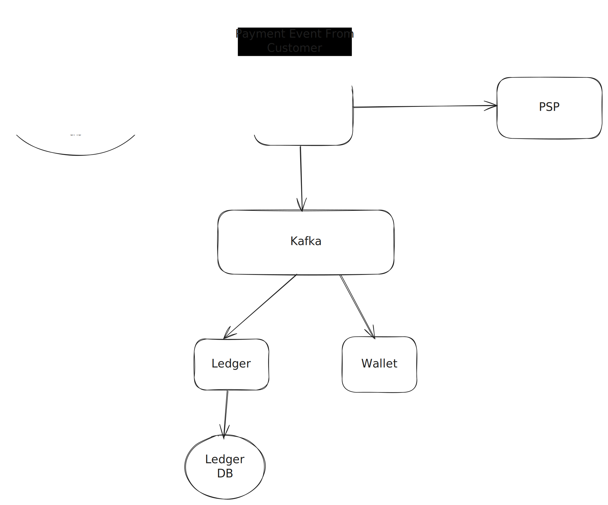

# Payment System

<p align="center">
  
</p>

There are two flows to discuss in a payment system, one is the payin flow and one is the payout flow.

The payment service receives a payment event to initiate a payment and it stores this event in the payment event db.

The payment event may look like this:

```
{
  "checkout_id": "CHCKT-20250721-ABCD-1234",
  "buyer_info": {
    "buyer_id": "BUYER-1A2B-3C4D-5E6F",
    "name": "Jane Doe",
    "email": "jane.doe@example.com"
  },
  "payment_orders": [
    {
      "seller_account": "SELL-XYZ-1",
      "amount": 75.00,
      "currency": "USD",
      "payment_order_id": "ORD-123-A"
    },
    {
      "seller_account": "SELL-ABC-2",
      "amount": 25.00,
      "currency": "USD",
      "payment_order_id": "ORD-123-B"
    }
  ]
}
```

**`payment_event` and `payment_order` Data Model in ASCII**

Here are the minimalistic data models for `payment_event` and `payment_order` represented in a simple ASCII diagram

```
+-----------------------------------+
|          payment_event            |
+-----------------------------------+
| PK checkout_id : VARCHAR          |
|-----------------------------------|
| buyer_id       : VARCHAR          |
| is_payment_done: BOOLEAN          |
| created_at     : TIMESTAMP        |
| updated_at     : TIMESTAMP        |
+-----------------------------------+
                  |
                  | one-to-many
                  v
+-----------------------------------+
|          payment_order            |
+-----------------------------------+
| PK payment_order_id: VARCHAR      |
|-----------------------------------|
| FK checkout_id     : VARCHAR      |
| seller_id          : VARCHAR      |
| amount             : DECIMAL      |
| psp_token          : VARCHAR      |
| currency           : VARCHAR      |
| payment_order_status : ENUM       |
| created_at         : TIMESTAMP    |
| updated_at         : TIMESTAMP    |
| failure_reason     : TEXT         |
+-----------------------------------+
```

## The checkout flow

1. A customer clicks "checkout" on the merchant's website. The merchant's frontend sends a high-level payment event to the Payment Service. This event includes order details like the total amount and a unique `checkout_id.

2. The Payment Service takes the payment event and internally creates one or more payment orders and then makes a `POST /payment_intent` API call to the chosen PSP (e.g., Stripe, Adyen). This request contains the amount, currency, and the merchant's payment_order_id (for idempotency) and the redirectUrl. The PSP, in response, returns a unique psp_token which represents the specific payment intent. The Payment Service then stores this psp_token and updates the payment_order status to EXECUTING. 

3. Once the PSP token is stored, the client displays a PSP Hosted webpage where the user fills a form containing the payment details.

4. Once the payment is done, the PSP returns the payment status and redirects the client to the `redirectUrl` it had received via payment intent.

5. Asynchronously, the PSP calls the payment service via a `callbackUrl` so that payment service can update the status of the order linked with the `psp_code`.
the `callbackUrl` is registered with the PSP during the initial setup while integrating the PSP withour payment service.

6. Once the payment service receives a payment successful event, it sends a payment successful event into Kafka queue. The wallet service and the ledger service will be the listeners of these events and once received will perform their respective tasks.

Following is the example of a sample payment intent POST api.

```
{
  "amount": 10000,
  "currency": "usd",
  "payment_method_types": ["card"],
  "description": "Payment for order ORD-123-A",
  "metadata": {
    "payment_order_id": "ORD-123-A",
    "checkout_id": "CHCKT-20250721-ABCD-1234",
    "seller_id": "SELL-XYZ-1"
  },
  "return_url": "https://yourdomain.com/payment/return",
  "statement_descriptor": "Your Shop Name"
}
```

## Payment Service and Payment Executor

The Payment Service receives the payment event and stores it in the DB. One payment event may contain multiple payment orders so each payment order is sent to Payment Executor.

The Payment Executor's service logic is designed to take a single payment order and execute it fully (e.g., register the intent, update the status). 
This process is executed for each distinct payment order.

* Concurrent Processing (In Parallel)
  While the logic is sequential per order, the execution of multiple orders from a single payment event is usually parallelized for performance:

 * Asynchronous Tasks: The Payment Service, after creating the payment orders, would submit them as separate tasks to the Payment Executor's queue or service layer.
 * Worker Pool: The Payment Executor service would maintain a pool of worker threads or use a message queue (like Kafka or RabbitMQ). Each worker would pick up a single payment order and process it independently of the others.
 * PSP Communication: For a single checkout_id (with two payment orders, say ORD-A and ORD-B), the Payment Executor can simultaneously:
	* Send the registration request for ORD-A to PSP 1.
	* Send the registration request for ORD-B to PSP 2.

1) Payment Service (The "Brain"):

	* Receives the high-level payment event (from the client).

	* Creates the detailed payment order (or multiple orders).

	* Initiates the request by sending the payment order to the Payment Executor via an internal API call or a message queue.

2) Payment Executor (The "Hand"):

	* Receives the specific payment order.

	* Performs the PSP integration task: It translates the internal payment order into the exact external API format required by the PSP.

	* Sends the payment registration request to the PSP.


## How to send money to an external client, someone who is not registered with the PSP

When your generic payment service determines it needs to pay an external, unregistered individual or business, it makes an API call to the PSP's Payout API or Transfer API.

The information that's needed to make the payment includes 

1. Recepient's bank account details.

   * Bank Account Number, Bank Name, Account Holder Name, Bank Identifier (e.g., IFSC Code in India, Routing Number/ABA in US, Sort Code in UK, BSB in Australia)
   
2. Amount and Currency: The exact amount to be paid and the currency.

3. Purpose of Payment/Description: A clear description of why the payment is being made (e.g., "Freelance work payment," "Refund for service," "Affiliate commission"). This is often required for compliance.

4. Your Internal Reference ID: A unique ID from your system to track this payout.

5. Webhook/Callback URL: For the PSP to notify your system of the payout's success or failure (as payouts are inherently asynchronous).

```
Example PSP Payout API Call (Conceptual):

// From Your Generic Payment Service to PSP's Payout API

POST https://payouts.psp.com/v1/payouts

X-API-Key: sk_payout_your_secret_key // Often a different API key for payouts

{
  "amount": {
    "value": 750,
    "currency": "USD"
  },
  "recipient_details": {
    "type": "bank_account",
    "account_holder_name": "Jane Doe",
    "account_number": "1234567890",
    "bank_name": "Anytown National Bank",
    "routing_number": "123456789",
    "address": {/* recipient's address for compliance */}
  },
  "purpose": "Freelance project payment for Order #456",
  "your_reference_id": "PAYOUT-ABC-789",
  "callback_url": "https://your_service.com/webhooks/payout_status"
}
```

Once the PSP has received this request, it validates the request at its end. 
It performs its own AML, fraud, and sanctions checks against the recipient's details.
Once the validation is successful, initiates a bank transfer (e.g., ACH, SEPA, Faster Payments, IMPS, SWIFT wire) from its own bank account to the recipient's bank account.

Once the payment is completed, the PSP sends an asynchronous webhook to your `callback_url` when the payout status changes (e.g., initiated, processing, completed, failed).

Your service receives the webhook, updates the internal status of the payout (e.g., "Pending Payout" to "Payout Completed" or "Payout Failed").

---

# Digital Wallet

### Using in Memory DB

Problem: We need to store user balances and process transfers.

Use a highly performant, in-memory key-value store like Redis. It's fast, can handle many reads/writes, and can be sharded (spread across multiple nodes).

**Why it seems good initially (Pros)**:
* High Throughput: In-memory operations are incredibly fast, offering low latency. Sharding allows for horizontal scaling to potentially reach 1M TPS for simple updates.
* Simplicity: Conceptually easy to understand: account_id -> balance.
**Cons** :

* **The "Strict Consistency" Requirement**: This is where the in-memory solution falls apart for a financial system. A balance transfer is not a single operation. It's two distinct operations:

Deduct from Account A.

Add to Account B.

* **Distributed Atomicity Problem**: If Account A and Account B reside on different Redis nodes (which they almost certainly will at 1M TPS scale due to sharding), there's no inherent way to guarantee that both operations succeed or both fail.

### Using RDBMS

The Realization:

We need ACID properties (Atomicity, Consistency, Isolation, Durability) for financial data. Relational Database Management Systems (RDBMS) are built for this.

**Challenge**: A single RDBMS node cannot handle 1M TPS. We still need to shard.

**New Problem**: Now we have a distributed RDBMS. A transfer still involves two updates on potentially different sharded database nodes. How do we ensure atomicity across these separate nodes?

**Solution Proposed**: Distributed Transactions (e.g., Two-Phase Commit)

How it works (Simplified):
* Coordinator: A central service (or logic within the Wallet Service) acts as a coordinator for the transaction.
* Participants: The individual database shards (or services owning those shards).

Try Phase (Prepare): The coordinator tells each participant (e.g., "prepare to deduct $X from Account A", "prepare to add $X to Account B"). Participants perform pre-checks, reserve resources (e.g., lock funds), and log their intent. They respond "yes, I can do it" or "no, I can't."

Confirm Phase (Commit): If all participants respond "yes," the coordinator tells them all to "commit." Each participant then makes its changes permanent.

Cancel Phase (Rollback): If any participant responds "no," or a timeout occurs, the coordinator tells all participants to "cancel." Each participant then undoes any changes made during the "Try" phase.

**Why it's better than In-Memory (Pros):**
* Atomicity: Guarantees that either both debit and credit operations complete, or neither does. Money is never lost or duplicated due to partial failures.
* Durability: RDBMS systems ensure data persistence.

**(Limitations/Cons)**:
* Performance Bottleneck: The coordinator can become a bottleneck, especially at 1M TPS. It's a synchronous, blocking protocol.
* Locking and Contention: Resources (like account balances) are locked during the "Try" phase, reducing concurrency and potentially leading to deadlocks.
* Coordinator Failure: If the coordinator fails during the commit phase, participants might be left in an uncertain state ("in doubt"). Recovery mechanisms are complex.
* Lacks Reproducibility: While the RDBMS itself records transactions, the process of reaching the final state isn't explicitly an event log that can be easily replayed to reconstruct historical states across the entire system. You still only have the result of the transaction.

Conclusion: RDBMS with TCC solves the immediate atomicity problem, but introduces performance and operational complexities at extreme scale, and doesn't fully address the "reproducibility" requirement in an elegant way.

### Event sourcing with SAGA Pattern

**SAGA PATTERN**

**Challenges**

* **Need for Reproducibility**: We need to be able to reproduce the series of events that led to a particular database state at a particular period of time. Basically
a way to audit the trail of transactions that led to a particular account balance.
* **Complexity of Distributed Transactions**: 2 Phase Commit is complex to implement and recover from. Sagas offer a more flexible way to manage multi-step distributed processes.
* **Synchronous Nature**: 2PC is inherently synchronous. All participants must respond before the transaction can proceed. This can introduce significant latency in geographically distributed systems or systems with many participating services.
* **Need for High Concurrency & Decoupling**: We still need to handle 1M TPS and avoid the blocking nature of 2PC/TCC. We want a more asynchronous, decoupled approach. This is where Sagas come in.

SAGA Pattern Offers a More Flexible Way to Manage Multi-Step Distributed Processes

Why it's more flexible:

* **Eventual Consistency**: Unlike 2PC, which aims for strong (immediate) consistency, the Saga pattern embraces eventual consistency. This means that at any given moment during a saga's execution, the system might be temporarily inconsistent, but it will eventually reach a consistent state. This trade-off allows for greater availability and performance.
* **Loosely Coupled Services**: Sagas are well-suited for microservices architectures, where services are independently deployed and managed, each with its own database. Services communicate asynchronously, typically via messages or events, without holding locks across service boundaries.
* **No Central Coordinator (Choreography)**: In a "choreography" based saga, there is no central orchestrator. Each service participates by reacting to events from other services and emitting its own events. This distributes the responsibility and avoids a single point of failure.
* **Compensating Transactions**: The core of the Saga pattern lies in "compensating transactions." If a step in the saga fails, preceding successful steps are undone by executing compensating actions. This allows for partial failures without blocking the entire system and provides a clear recovery path.

**Event Sourcing**

Instead of storing the final state, we store a sequence of events that led to that state.

A "balance transfer" is no longer two database updates; it's a command (e.g., `TransferMoneyCommand`) that, when successfully processed, generates an event (e.g., `MoneyDeductedEvent` and `MoneyCreditedEvent`).

These events are stored in an append-only Event Store (a durable, distributed log).

The current account balance (the "state") is then derived by replaying these events from the Event Store. For read performance, snapshots of the state can be periodically taken.

**Pros**
* **Decoupling**: Services react to events, making them highly independent.
* **Scalability**: The Event Store can be highly optimized for writes (append-only), and read models can be scaled independently (CQRS).

**How Event Sourcing is taking place ?**

How it works for a Wallet (Write Path):

1. **Client sends a Command**: A user initiates a transfer, which translates into a TransferMoneyCommand (e.g., (A: -C$, B: +C$)). This command is received by the `Wallet Service`.
2. **Command Validation and State Transition**:
   * The Wallet Service (acting as a "state machine") receives the command.
   * It retrieves the current state of the relevant accounts (e.g., Account A's balance) to perform validation (e.g., "does A have enough money?"). This might involve loading events and reconstructing the state or using a snapshot.
   * If the command is valid, the state machine generates one or more Events that represent the changes. For a transfer, it might generate a `MoneyDeductedEvent` for Account A and a `MoneyCreditedEvent` for Account B.
3. **Events Persisted to Event Store**: These newly generated events are appended to an immutable, ordered Event Store (a distributed log). This is the crucial step that ensures reproducibility and durability.
4. **Acknowledgement**: Once events are successfully written to the Event Store, the command is considered processed, and an acknowledgement is sent back to the client.

We used event sourcing with SAGA pattern to solve problem of distributed transactions and database final state reproducibility.
With this we were able to optimize our write path but we haven't provided any way for end user to view the state. We have made our final state reproducible,
but it's not readily viewable or queryable in an efficient manner directly from the event store for end-users. And that's why `CQRS (Command Query Responsibility Segregation) pattern' is introduced.

In CQRS pattern, we maintain an optimized data store (the "Read Model") that is populated by consuming and processing the events from the Event Store.


**Snapshots**

Snapshots in Event Sourcing are periodic saved copies of an aggregate's (e.g., a wallet account's) current state.

Why they are used: To significantly improve performance. Instead of reconstructing an account's balance by replaying all its past transactions (events) from the very beginning, the system can load the latest snapshot and then only apply the few events that occurred after that snapshot to get the most up-to-date state.