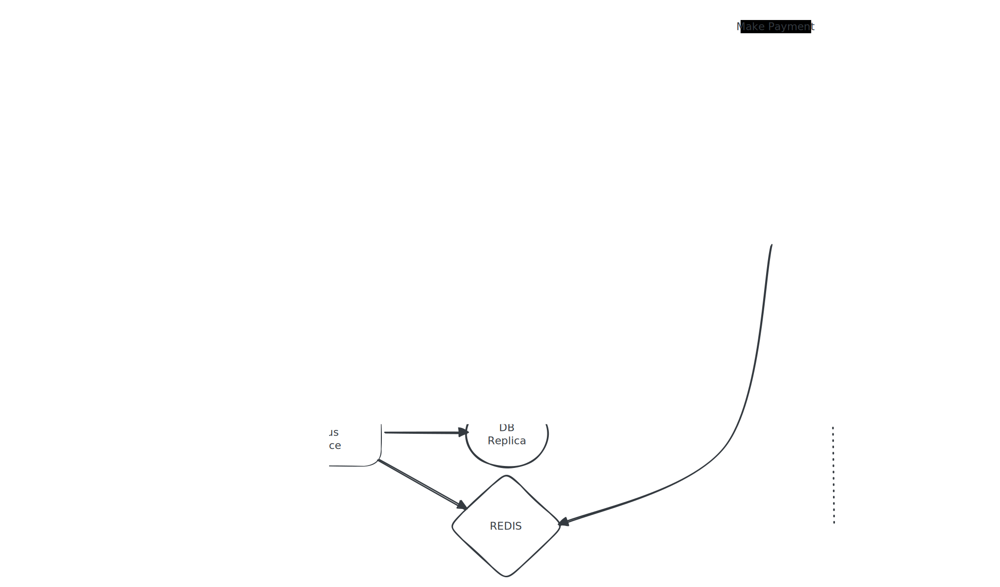

# Payment Processing System Design

<p align="center">
  
</p>

## 1. Payment Request

The Payment Service receives a payment request from the client. A single checkout may contain one or more payment orders that need to be processed independently.

The incoming payment event has the following structure:

```json
{
    "checkout_id": "...",
    "paying_user_id": "...",
    "payment_orders": [
        {
            "payment_order_id": "...",
            "currency": "...",
            "amount": "...",
            "merchant_id": "...",
            "redirectUrl": "..."
        },
        {
            "payment_order_id": "...",
            "currency": "...",
            "amount": "...",
            "merchant_id": "...",
            "redirectUrl": "..."
        }
    ]
}
```

---

# 2. Data Model

The system persists the payment event in a relational database.

### payment_event

* **Primary Key:** `checkout_id`
* `checkout_id` also serves as the idempotency key to ensure duplicate payment requests are not created.
* Stores metadata for the overall checkout, such as the paying user.

### payment_order

Each payment order is stored as a separate row.

* **Primary Key:** `payment_order_id`
* **Foreign Key:** `checkout_id`
* Stores:

  * amount
  * currency
  * merchant_id
  * redirectUrl
  * payment_token
  * payment status

The `payment_order_id` also acts as the idempotency key while communicating with the Payment Service Provider (PSP), ensuring retries do not create duplicate payment orders.

---

# 3. Database Architecture

The payment system uses a relational database deployed in a Master-Replica configuration.

* All writes are directed to the Master database.
* Read requests are primarily served by database replicas.
* The Master database remains the single source of truth.

---

# 4. Payment Order Processing

Once the Payment Event and its associated Payment Orders have been successfully persisted, Change Data Capture (CDC) streams newly created payment orders into Kafka.

```
Payment Service
       │
Persist Payment Event + Payment Orders
       │
      CDC
       │
     Kafka
       │
Payment Executor Workers
```

Each Payment Executor Worker consumes payment order events independently.

The worker establishes communication with the appropriate Payment Service Provider (PSP) to initiate the payment.

The payment initiation request contains the `payment_order_id`, which acts as the merchant reference/idempotency key at the PSP. This ensures that retries caused by network failures or worker restarts do not create duplicate payments.

If the PSP successfully accepts the payment request, it responds with a unique `payment_token`.

---

# 5. Persisting the Payment Token

Upon receiving the `payment_token`, the worker performs the following sequence:

1. Update the corresponding payment order in the Master database with:

   * payment_token
   * payment status = TOKEN_RECEIVED

2. After the database transaction commits successfully, synchronously update Redis with the latest payment status.

Redis is treated purely as a cache and **not** as the source of truth. The Master database remains authoritative.

Meanwhile, CDC continues publishing database changes to Kafka for downstream consumers such as analytics, auditing, reconciliation services, and cache rebuilding.

---

# 6. Payment Status Service

Immediately after submitting the payment request, the client establishes a long-poll connection with the Payment Status Service.

The Payment Status Service follows the read path below:

1. Check Redis for the latest payment status.
2. If the status is unavailable in Redis, fall back to the database replica.
3. If the payment token has not yet been generated, keep the long-poll request open until either:

   * the payment token becomes available, or
   * the request times out.

This avoids unnecessary polling responses while minimizing read traffic on the primary database.

Once the worker updates the payment order with the `payment_token`, the Payment Status Service returns:

* status = TOKEN_RECEIVED
* payment_token
* redirectUrl

to the client.

---

# 7. Redirecting to the PSP

After receiving the `TOKEN_RECEIVED` status, the client redirects the user to the PSP-hosted payment page using the supplied `redirectUrl`.

Since the PSP hosts the payment page, all sensitive payment details (such as card information) are entered directly on the PSP's infrastructure and never pass through the Payment Service.

When the customer submits the payment form, the previously generated `payment_token` is sent back to the PSP. The PSP uses this token to uniquely identify the corresponding `payment_order`.

---

# 8. Payment Completion

After the customer completes the payment, two independent events occur:

1. The customer's browser is redirected back to the merchant's `redirectUrl`.
2. The PSP sends a server-to-server webhook to the Payment Service containing the final payment result.

The webhook is considered the authoritative source of payment status.

Upon receiving the webhook, the Payment Service validates the webhook, updates the payment status in the Master database, and refreshes the corresponding Redis entry.

Possible terminal states include:

* SUCCESS
* FAILED
* CANCELLED

---

# 9. Handling the Redirect vs. Webhook Race Condition

The browser redirect and the webhook are independent operations and may arrive in any order.

In many cases, the customer's browser returns to the merchant application before the webhook has been processed. If the frontend immediately queries the payment status, the payment may still appear as **PROCESSING** or **PENDING**, even though the payment has already completed successfully at the PSP.

Therefore, the browser redirect should **not** be treated as confirmation that the payment has completed.

Instead, after the redirect, the frontend displays a **"Verifying Payment..."** screen and continues long-polling the Payment Status Service (or alternatively maintains an SSE/WebSocket connection) until the webhook has updated the payment status.

Once the webhook has been processed, the Payment Status Service returns the final payment status (SUCCESS, FAILED, or CANCELLED), allowing the frontend to display the correct result.

This approach correctly handles both event orderings, avoids race conditions, and provides a smooth user experience while ensuring that the webhook remains the authoritative source of payment completion.
