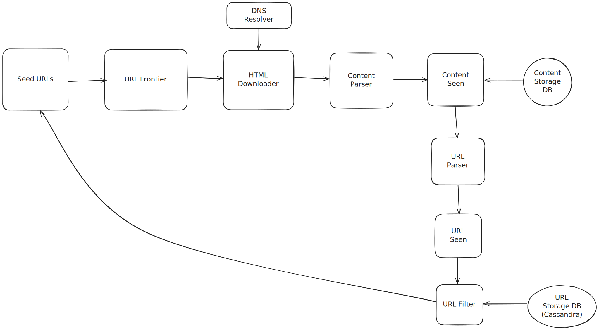
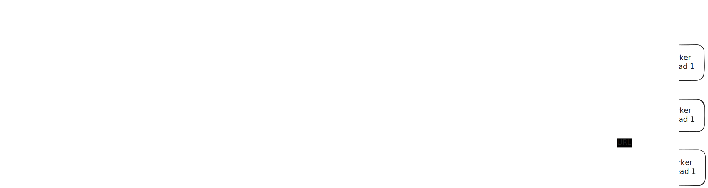

# Web Crawler

---

This section outlines the key components and their roles within the Web Crawler.

This design is based on **Chapter 9 Design a Web Crawler** from the Book **System Design Interview Volume 1 by Alex Xu**.

There are some **.excalidraw** file which can be imported in [Excalidraw](https://excalidraw.com/) for additional customization to the design proposed.

## Components

There are some main components that i'll elaborate upon, rest of the things can be referred directly from the chapter in the book.

### URL Frontier

For URL Frontier, a two tiered Queuing System is created.

**Why Two Tiered Queuing?**

The URL Frontier Component on a high level is a FIFO queue that holds the URL and we perform a BFS using this queue to parse URLs.
Now it could be the case that some URLs hold more priority and thus should be parsed before other URLs.
And if all high priority URLs belong to the same host, then our web crawler can end up launching a DDoS attach on the host servers.

Two tiered Queuing system solves 2 Problems:

1) Prioritization: High-priority URLs can be identified and made available for fetching sooner.
2) Politeness / Host-based Rate Limiting: URLs belonging to the same host can be processed with a controlled delay to avoid overwhelming the server.

Front Queue solved prioritization.
Back Queue solved Politeness.

These are high-performance, message queues (e.g., Kafka topics) and act as "buffers in memory" 
for fast enqueue/dequeue operations, minimizing direct disk reads/writes.

The back queue is also high-performance message queues (e.g., Kafka topics/partitions) 
where each queue is typically dedicated to URLs from a single host or domain.

**Prioritization Strategies** 

Some Prioritization Strategies which can be implemented in the Prioritizer are

1. **PageRank/Authority-based**: Prioritize URLs deemed more "important" by link analysis (e.g., higher PageRank), leading to higher-quality content discovery.

	Example: When crawling, www.nytimes.com/world would be prioritized over myblog.com/personal-opinion because nytimes.com has 
	significantly more inbound links from other high value sources, indicating higher value.

2. **Freshness/Update Frequency-based**: Prioritize URLs that change often, ensuring the index is up-to-date with dynamic content.

	Example: A URL like www.reuters.com/news/article-today would be re-crawled every hour, 
	while www.olduniversity.edu/alumni-list-1980 might only be re-crawled once a month, as news sites update far more frequently.

3. **Breadth-First Search (BFS)/Depth-based**: Prioritize URLs closer to initial starting points (lower link depth), quickly covering a broad range of sites.

	Example: If you start at www.example.com (depth 0), 
	then www.example.com/about (depth 1) and www.example.com/contact (depth 1) would be prioritized over www.example.com/archive/2005/jan/old-post-details (depth 3), 
	ensuring the top-level pages are discovered first.

4. **URL Pattern/Type-based**: Prioritize URLs based on their structure or expected content type (e.g., HTML articles over images), allowing for focused crawls.

	Example: A crawler primarily interested in articles would prioritize www.techsite.com/articles/latest-gadget-review.html 
	over www.techsite.com/images/logo.png or www.techsite.com/forum/threadid=12345.

**Queue Mapper** 

The Queue mapper takes a URL, figures out the queue for the URL using the Queue Mapper DB, and then pushes the url into its designated queue.
The Queue mapper db is a key value store which maintains a mapping of Host to Queue.

Every host has a queue assigned to it and every queue has a worker assigned to it.
Every worker polls a url from its designated queue and downloads the HTML.

**Choice of Database for Queue Mapper DB**

We can either choose Redis or Cassandra Db as the DB to store mapping of host to Queue.

Redis is a good choice for our case as we need lower latency on reads.
While Cassandra is also a good choice, but its latency is higher than redis for read operation.
Also Cassandra is more optimized for High Frequency Writes which is an overkill for our case.

**Why not a RDBMS ?**

While an RDBMS can work for smaller scales, scaling it horizontally for the potentially billions of hosts 
your crawler might encounter becomes complex and expensive (sharding, replication)

**Underlying Persistent Storage**

While the Front and Back Queues handle active scheduling, the URL Frontier also relies on a separate, 
dedicated disk storage (e.g., a Cassandra cluster). 

This storage holds:
* The entire, comprehensive list of all URLs ever encountered, along with their detailed metadata and crawl status, 
for long-term durability and full system recovery.
* It acts as the backing store for the global "URL Seen?" component to ensure complete deduplication.

 
## 2. HTML Downloader

These are distributed worker servers which store a subset of url. Each Server runs multiple threads for crawling websites.

To increase their performance, these worker servers are stored closer to host servers.
Also a cache is used by these worker servers to avoid frequent contact to DNS Servers for obtaining IP Addresses. 

## 3. Content Storage

For Content Storage, we would adopt a hybrid approach leveraging a Distributed File System (DFS) or Object Storage for the bulk of the raw HTML content, 
complemented by a NoSQL Database for metadata and indexing purposes.

The DFS/Object Storage (e.g., HDFS, S3) is chosen because the total data set is too big to fit in memory. 
It provides massive, cost-effective, and durable storage for petabytes of raw HTML.

A NoSQL Database like Cassandra would handle the metadata of the processed Content. 

This combination allows for efficient indexing, querying, and storage of specific web pages, which the DFS alone cannot provide.