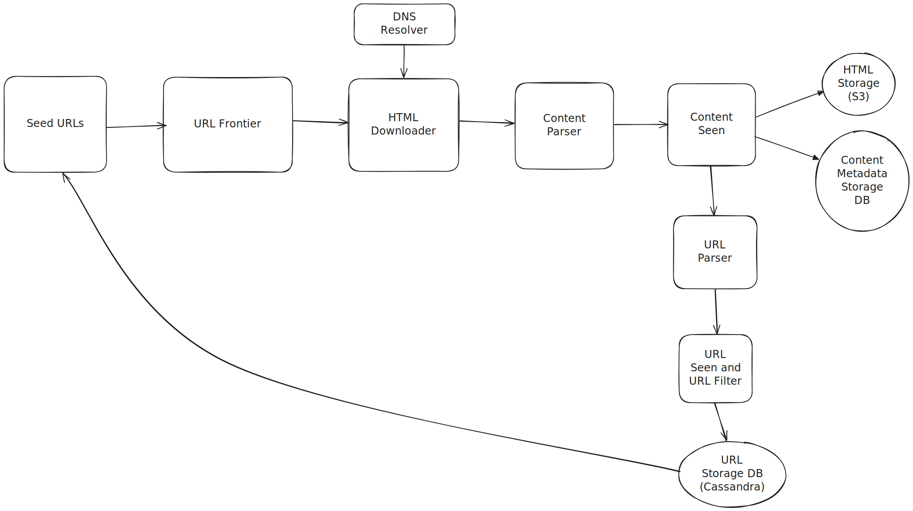
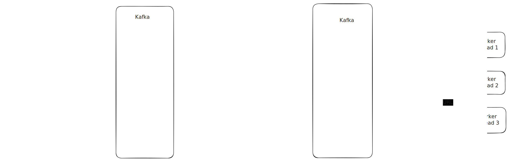

# Web Crawler

---

This section outlines the key components and their roles within the Web Crawler.

This design is based on **Chapter 9 Design a Web Crawler** from the Book **System Design Interview Volume 1 by Alex Xu**.

There are some **.excalidraw** file which can be imported in [Excalidraw](https://excalidraw.com/) for additional customization to the design proposed.

## Components

There are some main components that i'll elaborate upon, rest of the things can be referred directly from the chapter in the book.

### URL Frontier

For URL Frontier, a two tiered Queuing System is created.

**Why Two Tiered Queuing?**

The URL Frontier Component on a high level is a FIFO queue that holds the URL and we perform a BFS using this queue to parse URLs.
Now it could be the case that some URLs hold more priority and thus should be parsed before other URLs.
And if all high priority URLs belong to the same host, then our web crawler can end up launching a DDoS attach on the host servers.

Two tiered Queuing system solves 2 Problems:

1) Prioritization: High-priority URLs can be identified and made available for fetching sooner.
2) Politeness / Host-based Rate Limiting: URLs belonging to the same host can be processed with a controlled delay to avoid overwhelming the server.

Front Queue solved prioritization.
Back Queue solved Politeness.

**Prioritization Strategies** 

Some Prioritization Strategies which can be implemented in the Prioritizer are

1. **PageRank/Authority-based**: Prioritize URLs deemed more "important" by link analysis (e.g., higher PageRank), leading to higher-quality content discovery.

	Example: When crawling, www.nytimes.com/world would be prioritized over myblog.com/personal-opinion because nytimes.com has 
	significantly more inbound links from other high value sources, indicating higher value.

2. **Freshness/Update Frequency-based**: Prioritize URLs that change often, ensuring the index is up-to-date with dynamic content.

	Example: A URL like www.reuters.com/news/article-today would be re-crawled every hour, 
	while www.olduniversity.edu/alumni-list-1980 might only be re-crawled once a month, as news sites update far more frequently.

3. **Breadth-First Search (BFS)/Depth-based**: Prioritize URLs closer to initial starting points (lower link depth), quickly covering a broad range of sites.

	Example: If you start at www.example.com (depth 0), 
	then www.example.com/about (depth 1) and www.example.com/contact (depth 1) would be prioritized over www.example.com/archive/2005/jan/old-post-details (depth 3), 
	ensuring the top-level pages are discovered first.

4. **URL Pattern/Type-based**: Prioritize URLs based on their structure or expected content type (e.g., HTML articles over images), allowing for focused crawls.

	Example: A crawler primarily interested in articles would prioritize www.techsite.com/articles/latest-gadget-review.html 
	over www.techsite.com/images/logo.png or www.techsite.com/forum/threadid=12345.

**Problem with Random IDs** 

If each instance generates random IDs, you risk collisions, 
and ensuring uniqueness becomes complex (e.g., constantly checking a database for existence).

**Solution** 

ID Block Allocation: Instead of getting one ID at a time, each distributed service instance (e.g., a "worker" or "application server") 
requests and holds a block of IDs (a contiguous range of numbers) from a central coordinator. 
It then uses these IDs locally from its allocated block, only returning to the coordinator when its block is exhausted.

**How it works**

 * When a URL Service starts up, or when it has used all the IDs from its currently allocated block, it sends a request
 to zookeeper for assigning an ID Block.
 
 * Once a worker has its allocated block ID Block, it stores this range in its local memory.
 
 * For every subsequent request sent to the URL Service to generate a short URL, the URL Service 
 increments its local counter (the value of the counter lies between the ID range assigned by zookeeper)
 and converts that counter value to a base 62 code which is the short url code.
 
 * If a URL Service instance crashed, then the ID Range assigned to it is lost and cannot be recovered.
 This is a known trade-off in this case. Given the vast number of IDs available (e.g., trillions for Base62), 
 losing a small fraction of IDs (e.g., 1 million per crash) is usually acceptable.
 
 
### 2. Choice of database

We chose a relational database for storing short code and long url combination.

* By choosing a relational database, we can enforce a Unique constraint on the short_code column 
making sure that a short_code generated is never used again for any other url.

* Databases typically create an index automatically when you add a UNIQUE constraint. 
This index makes lookups by short_code (which is the most frequent operation during redirection) extremely fast, which is critical for performance.

* It also simplifies our logic at the URL Service layer. While inserting a record,
The URL Service doesn't have to check if short_Code key exists or not, it can rely on the database to prevent duplicates.
The URL Service can just attempt an insert, and if it fails due to a unique constraint violation, it knows to generate another short_code.