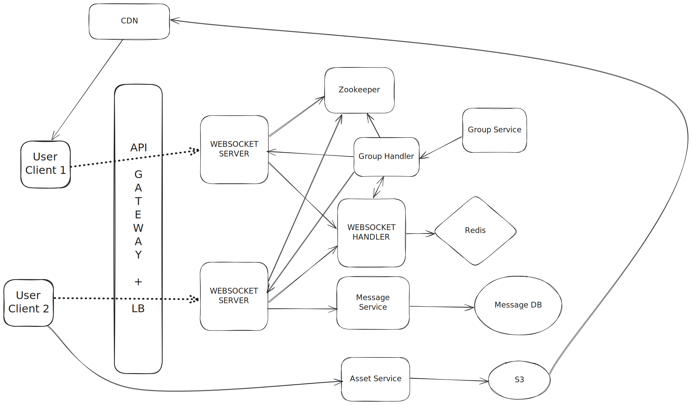

# Capacity Estimation

With 10M DAU and 10 messages per user per day, we expect ~100M messages per day, or ~1–1.2K messages per second on average and ~10–12K per second at peak. Assuming ~100 bytes per message, storage grows by ~10GB per day or ~4TB per year, excluding metadata. At this scale, we need horizontal scaling and partitioned storage.

Assuming each user is opening the app 10 times a day and on each app open, recent converstaions are loaded then there are 100M load conversations calls which is 1K calls per second or 10k calls per second at peak. And this is only for opening the app, but when the user opens individual chats then there are more requests sent to fetch the conversation history itself, which adds up to the 10k calls we calculated. So the system is a net- read system mostly.

By calculation, the system appears read heavy, but it is write heavy in terms of correctness


# Whatsapp Schema

```
CREATE TABLE messages (
    conversation_id   text,
    message_ts        timeuuid,
    sender_id         text,
    body              text,
    PRIMARY KEY (conversation_id, message_ts)
) WITH CLUSTERING ORDER BY (message_ts DESC);

CREATE TABLE inbox (
    user_id     text,
    message_ts  timeuuid,
    conversation_id text,
    sender_id   text,
    body        text,
    delivered   boolean,
    PRIMARY KEY (user_id, message_ts)
) WITH CLUSTERING ORDER BY (message_ts ASC);

CREATE TABLE user_conversations (
    user_id         text,
    conversation_id text,
    last_message_ts timeuuid,
    PRIMARY KEY (user_id, conversation_id)
);

All chats for a user 

SELECT conversation_id, last_message_ts FROM user_conversations WHERE user_id = 'user_B';


CREATE TABLE conversation_participants (
    conversation_id text,
    user_id         text,
    PRIMARY KEY (conversation_id, user_id)
);

All participants for a conversation 

SELECT user_id FROM conversation_participants WHERE conversation_id = 'conv_AB';


```

This creates a table called messages with 4 columns:

* **conversation_id (text)** : Which chat/conversation the message belongs to.
* **message_ts (timeuuid)** : A timestamp-encoded unique ID that also gives ordering.
* **sender_id (text)** : Who sent the message.
* **body (text)** : The text message content.

**Meaning of the PRIMARY KEY**

`PRIMARY KEY (conversation_id, message_ts)`


Cassandra’s primary key has two parts:

* Partition Key : `conversation_id`

All messages for the same conversation go into the same partition. A partition is stored on one node (or replicas) based on hashing. 
Queries must specify conversation_id to retrieve messages. So every chat (1:1 or group) is a separate partition.

* Clustering Key : `message_ts`

Within the partition, all rows (messages) are sorted by message_ts.

This allows fast:
	“load latest N messages”
	“scroll up for older messages”
	“read messages in correct order”

**Meaning of:**  `WITH CLUSTERING ORDER BY (message_ts DESC)`

This tells Cassandra:

Store messages in descending order of message_ts inside each conversation.
So the newest messages appear first in the partition.

This makes the most common messaging query extremely fast:

`SELECT * FROM messages WHERE conversation_id = ? LIMIT 50;`

Cassandra can return the newest 50 messages directly without scanning.

## How attachment works ?

Attachment are stored separately, only their metadata is store in the database but the media content is stored in an object storage like s3.
But then the attachment is not served via S3, it is served via CDN.

**How CDN works ?**

* Media (images/videos) is uploaded to S3, not the CDN.
* The CDN automatically fetches files from S3 on the first request (cache miss).
* Subsequent requests are served from CDN cache (fast + cheap).
* Users should always receive a CDN URL, not an S3 URL.
* Backend sends the media URL as something like: https://cdn.myapp.com/media/abc123.jpg

**Why not Serve directly from S3 ?**

Because there's no built in cache and every request then will directly hit S3. Global downloads become high in latency.
If there a very popular media being shared then there's a chance that the trafic will spike massively to retrieve data from S3.

Instead serving via CDN is a better way as CDN is a network of servers located gloablly and can easily serve content to nearest users with better latency.

## Delete message for me

We add a table to work as a delete marker per user
```
CREATE TABLE deleted_messages_for_user (
    user_id text,
    conversation_id text,
    message_ts timeuuid,
    PRIMARY KEY ((user_id, conversation_id), message_ts)
);
```
When user clicks delete for me then we execute :

```
INSERT INTO deleted_messages_for_user
(user_id, conversation_id, message_ts)
VALUES ('user_A', 'conv_AB', <message_ts>);

```

when fetching messages, we execute following commands and filter at application level

```
SELECT * FROM messages WHERE conversation_id = 'conv_AB';

SELECT message_ts FROM deleted_messages_for_user
WHERE user_id = 'user_A'
AND conversation_id = 'conv_AB';

```

## Delete message for All

We modify our messages table and add 2 columns

```
is_deleted boolean
deleted_at timeuuid
```

When a user deletes a table we execute :

```
UPDATE messages
SET is_deleted = true,
    deleted_at = now()
WHERE conversation_id = 'conv_AB'
AND message_ts = <message_ts>;

```

Because you denormalized message in inbox table:

You must also update:

```
UPDATE inbox
SET body = 'This message was deleted',
    delivered = true
WHERE user_id = 'user_B'
AND message_ts = <message_ts>;
```

this is done for all participants