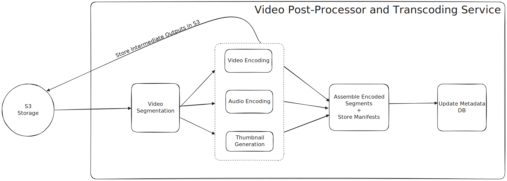

# Video Streaming Service

---

Only Video Post-Processing / Video Transcoding Service is discussed because that is the most important aspect of a Video
streaming platform.

## Video Post-Processing/ Video Transcoding Service

Whenever we upload a video, it is stored into an Object Storage like S3.
Once a file is stored in S3, S3 triggers an event and sends video to Video Transcoding Service.

The post-processing/Video Transcoding Service is a "pipeline" which produces the following outputs:

	1. Video segment files in different formats (codec and container combinations) stored in S3.
		
	2. Manifest files (a primary manifest file and several media manifest files) stored in S3. 
	The media manifest files will reference segment files in S3.

In order to generate the segments and manifest files, the stepwise order of operations will be:

	1. Split up the original file into segments (using a tool like ffmpeg or similar). These segments will be transcoded (converted from one encoding to another) and used to generated different video containers.
	
	2. Transcode (convert from one encoding to another) each segment and process other aspects of the segments (audio, transcript generation).
	
	3. Create manifest files referencing the different segments in different video formats.
	
	4. Mark the upload as "complete".

The Video Post Processing Pipeline can be thought of as a DAG, which embodies the properties of a DAG:

	* Directed: Each step in the pipeline has a clear, one-way flow. For example, you must split a video into segments before you can transcode those segments. Data moves forward from one task to the next; it never flows backward.

	* Acyclic: There are no "loops" or "cycles" in the workflow. A task will never depend on itself, nor will a series of tasks eventually lead back to a task that has already been completed. This ensures the pipeline always progresses towards completion and avoids infinite processing loops.

**Internal Working of Video Post-Processing Service**

	1. Whenever a video is uploaded completely into S3, S3 Event Notification triggers an AWS Lambda function 
	which starts an AWS Step Function Workflow

	2. The Step Functions workflow performs these steps:

		* (Segmentation): Invokes another Lambda function (or a Fargate task via AWS Batch) to video into different audio and video segments etc., storing them in s3.

		* Video and Audio Encoding: These are lambdas, that are orchestrated by the AWS Step Function workflow and these parallely encode audio and video segments into various resolutions and bitrates to support adaptive bitrate streaming. The results of these processes are stored in S3, so that they can be assembled later.

		* Thumbnail Generation: This is another lambda function that generates a thumbnail for the video.

		* Assembly and Manifest Generation: Once Audio Encoding and Video Encoding for various segments are done, the AWS Step Function workflow then triggers another lambda that assembles the various audio and video encodings that were generated in previous steps and generates a manifest file which acts as an index of these encodings. And then stores the manifest in the lambda.

		* The last step of this process would be to update the metadata db containing the meta data details if the video.

### URL Frontier

For URL Frontier, a two tiered Queuing System is created.

**Why Two Tiered Queuing?**

The URL Frontier Component on a high level is a FIFO queue that holds the URL and we perform a BFS using this queue to parse URLs.
Now it could be the case that some URLs hold more priority and thus should be parsed before other URLs.
And if all high priority URLs belong to the same host, then our web crawler can end up launching a DDoS attach on the host servers.

Two tiered Queuing system solves 2 Problems:

1) Prioritization: High-priority URLs can be identified and made available for fetching sooner.
2) Politeness / Host-based Rate Limiting: URLs belonging to the same host can be processed with a controlled delay to avoid overwhelming the server.

Front Queue solved prioritization.
Back Queue solved Politeness.

These are high-performance, message queues (e.g., Kafka topics) and act as "buffers in memory" 
for fast enqueue/dequeue operations, minimizing direct disk reads/writes.

The back queue is also high-performance message queues (e.g., Kafka topics/partitions) 
where each queue is typically dedicated to URLs from a single host or domain.

**Prioritization Strategies** 

Some Prioritization Strategies which can be implemented in the Prioritizer are

1. **PageRank/Authority-based**: Prioritize URLs deemed more "important" by link analysis (e.g., higher PageRank), leading to higher-quality content discovery.

	Example: When crawling, www.nytimes.com/world would be prioritized over myblog.com/personal-opinion because nytimes.com has 
	significantly more inbound links from other high value sources, indicating higher value.

2. **Freshness/Update Frequency-based**: Prioritize URLs that change often, ensuring the index is up-to-date with dynamic content.

	Example: A URL like www.reuters.com/news/article-today would be re-crawled every hour, 
	while www.olduniversity.edu/alumni-list-1980 might only be re-crawled once a month, as news sites update far more frequently.

3. **Breadth-First Search (BFS)/Depth-based**: Prioritize URLs closer to initial starting points (lower link depth), quickly covering a broad range of sites.

	Example: If you start at www.example.com (depth 0), 
	then www.example.com/about (depth 1) and www.example.com/contact (depth 1) would be prioritized over www.example.com/archive/2005/jan/old-post-details (depth 3), 
	ensuring the top-level pages are discovered first.

4. **URL Pattern/Type-based**: Prioritize URLs based on their structure or expected content type (e.g., HTML articles over images), allowing for focused crawls.

	Example: A crawler primarily interested in articles would prioritize www.techsite.com/articles/latest-gadget-review.html 
	over www.techsite.com/images/logo.png or www.techsite.com/forum/threadid=12345.

**Queue Mapper** 

The Queue mapper takes a URL, figures out the queue for the URL using the Queue Mapper DB, and then pushes the url into its designated queue.
The Queue mapper db is a key value store which maintains a mapping of Host to Queue.

Every host has a queue assigned to it and every queue has a worker assigned to it.
Every worker polls a url from its designated queue and downloads the HTML.

**Choice of Database for Queue Mapper DB**

We can either choose Redis or Cassandra Db as the DB to store mapping of host to Queue.

Redis is a good choice for our case as we need lower latency on reads.
While Cassandra is also a good choice, but its latency is higher than redis for read operation.
Also Cassandra is more optimized for High Frequency Writes which is an overkill for our case.

**Why not a RDBMS ?**

While an RDBMS can work for smaller scales, scaling it horizontally for the potentially billions of hosts 
your crawler might encounter becomes complex and expensive (sharding, replication)

**Underlying Persistent Storage**

While the Front and Back Queues handle active scheduling, the URL Frontier also relies on a separate, 
dedicated disk storage (e.g., a Cassandra cluster). 

This storage holds:
* The entire, comprehensive list of all URLs ever encountered, along with their detailed metadata and crawl status, 
for long-term durability and full system recovery.
* It acts as the backing store for the global "URL Seen?" component to ensure complete deduplication.

 
## 2. HTML Downloader

These are distributed worker servers which store a subset of url. Each Server runs multiple threads for crawling websites.

To increase their performance, these worker servers are stored closer to host servers.
Also a cache is used by these worker servers to avoid frequent contact to DNS Servers for obtaining IP Addresses. 

## 3. Content Storage

For Content Storage, we would adopt a hybrid approach leveraging a Distributed File System (DFS) or Object Storage for the bulk of the raw HTML content, 
complemented by a NoSQL Database for metadata and indexing purposes.

The DFS/Object Storage (e.g., HDFS, S3) is chosen because the total data set is too big to fit in memory. 
It provides massive, cost-effective, and durable storage for petabytes of raw HTML.

A NoSQL Database like Cassandra would handle the metadata of the processed Content. 

This combination allows for efficient indexing, querying, and storage of specific web pages, which the DFS alone cannot provide.

--- 

# News Aggregator

We can use the same design for creating a News Aggregator.
But in this case there will be some minor changes.

1. The seed URLs will be URLs of global news sources (e.g., major news websites, RSS/Atom feeds)

2. The Prioritizer component within the URL Frontier assigns high priority to new article URLs 
and frequently updated sources (e.g., news feeds or homepages of news sites are prioritized for freshness).

3. HTML Downloader (Worker Threads) Fetches the content of the URLs received from the URL Frontier. 
This involves making HTTP requests. For news, it might first try to fetch RSS/Atom feeds.

4. The content parser, in this case extracts the content and creates a deduplication hash for unique content which is then stored in the content storage.

4. For content storage, we can use a combination of cassandra and elastic search. 
Elastic Search to enable fast searching of content, and cassandra to store metadata.

## How cassandra and elastic search are utilised:

1. When a unique news article is parsed, its core metadata are written to Cassandra.

2. Simultaneously (or shortly after), the searchable parts (title, snippet, extracted text, key metadata) are indexed into Elasticsearch.

3. When a user requests their news feed:

	* The front-end queries Elasticsearch for articles based on recency, categories, keywords, or personalization rules.
	* Elasticsearch returns a list of article IDs and snippets.
	* If any additional details or the original URL are needed beyond what's in Elasticsearch, a quick lookup in Cassandra (using the article ID) can retrieve them.
	* The user is then redirected to the original publisher's site using the URL stored in Cassandra/Elasticsearch.

This combination allows you to combine Cassandra's strengths in high-volume, highly available, and massive-scale data persistence 
with Elasticsearch's unparalleled capabilities for full-text search and real-time analytics, perfectly fitting your news aggregator's requirements.