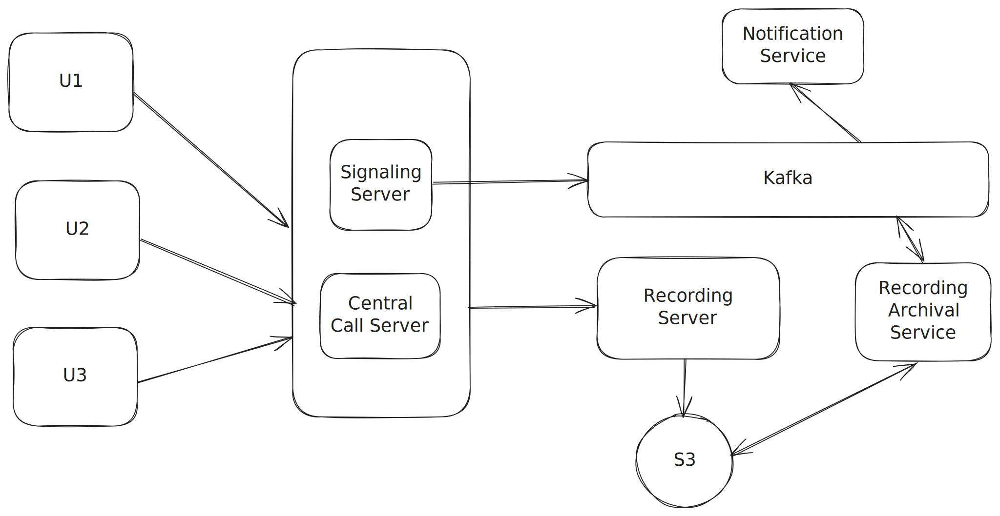
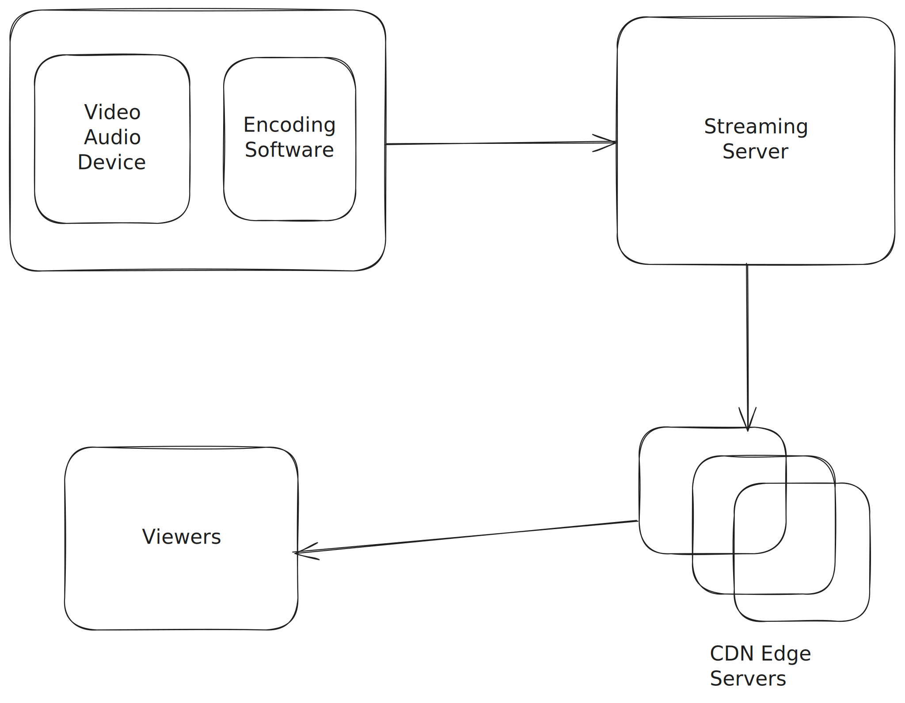

# Live Streaming and Video Calling

## TCP and UDP

Most of the client server communication happens over TCP (Transmission Control Protocol) using HTTP, HTTPS or Websocket.

TCP is a connection oriented protocol, to establish 1 connection between client and a server, 3 way handshake occurs between client and server.
TCP is a lossless protocol and it ensures data packets are delivered in order, without duplication, and retransmits any lost packets. 
This reliability introduces overhead compared to UDP, which does not guarantee delivery or ordering.

UDP is a connectionless protocol and doesn't guarantee ordering of data. Also some data packets might be lost during transmission. UDP ensures at most once delivery of messages.

**Why UDP is useful for Video Calling / Live Streaming**

* Low Latency – In real-time applications, it’s better to drop a frame than wait for it to be resent. TCP retransmissions would cause delays and freeze the video.
* Continuous Flow – Even if some packets are lost, the video/audio can keep playing without waiting.
* No Ordering Requirement – A lost or late video frame isn’t useful anymore; UDP just sends the next one without delay.
* Less Overhead – Smaller headers and no connection management mean more bandwidth for actual audio/video data.

## 1 - 1 Video calling Scenario

  

For a one-to-one video call between User 1 (U1) and User 2 (U2), both devices need to establish a direct connection over **UDP (User Datagram Protocol)** for efficient media transfer. To achieve this, U1 and U2 first connect to a **STUN (Session Traversal Utilities for NAT)** server. The **STUN** server's role is to help each device discover its public IP address and port, a process known as "NAT traversal."

This public address information is then exchanged between U1 and U2 through a signaling channel, typically a WebSocket. This channel is also used to negotiate technical details, such as supported video codecs, resolutions, and available bandwidth. This negotiation process, using the **Session Description Protocol (SDP)**, ensures that the call quality is optimized for the lowest-capability device or network. For example, if U2 is on a low-bandwidth connection, both devices will agree to transmit a lower-resolution video stream.

After the exchange and negotiation are complete, the devices attempt to establish a direct, peer-to-peer UDP connection using the public IP addresses they discovered. The actual video call is then a continuous stream of data packets flowing directly between the two devices, with each acting as both a sender and a receiver.

In scenarios where a direct peer-to-peer connection is blocked by a restrictive firewall or network configuration (such as a symmetric NAT), the connection attempt will fail. In such cases, the system falls back to a **TURN (Traversal Using Relays around NAT)** server. The **TURN** server does not just help with finding IP addresses; its primary function is to relay all the UDP media traffic between U1 and U2. This ensures the call can still proceed, though with slightly more latency due to the data being routed through an intermediary server.

A firewall interruption occurs at the edge of the local network, such as a home router's NAT firewall or a corporate network's gateway. These firewalls are designed to block incoming connections that aren't a direct response to an outgoing request. If this interruption prevents a direct UDP connection, the system falls back to a TURN (Traversal Using Relays around NAT) server. The TURN server's role is to relay all the UDP media traffic between U1 and U2, ensuring the call can still proceed, though with slightly more latency due to the data being routed through a middleman server.

All of this is part of the overall WebRTC framework.

## Group Calling Scenario

  

While in a 1:1 calling scenario, it is efficient for devices to communicate directly using a peer-to-peer connection, in a group calling scenario this quickly increases device load.

Suppose there are n participants in a group call. In a pure peer-to-peer mesh, each device must send n − 1 outbound streams (one to each other participant) and receive n − 1 inbound streams. This results in bandwidth and CPU usage growing linearly with the number of participants.

For larger groups, this model becomes inefficient. In such a case we will follow the Call server approach so each user will be sending to receiving from only the call server. This might put some load on the call server but that is easily manageable by scaling the hardware as per requirement. User’s bandwidth is something we can not control so our priority will be to optimize the use of users’ bandwidth utilization.

**Selective Forwarding**

In a teams and zoom web conference, sometimes a particular might be interested in a high resolution stream for one partcular user while for other streams it might need lower resolution.
This represents the functionality in zoom or teams where video from 1 user in a conference call is enlarged while all other users appear minimised.

In selective forwarding, the call server takes in streams from all users and then the call server only sends clients the streams they care about and in appropriate resolutions. 
The client sends its requriement to call server via signaling server.

The encoding of videos happens at client side only because if the Call server itself handles encoding of all other streams then not only the latency will increase, but the call server will also come under a lot of load.
Instead The encoding for different resolutions takes place on the sender's device.

When you join a group call, your device's WebRTC engine takes your video feed and encodes it into multiple versions simultaneously. For example, it might create a high-quality 1080p stream, a medium-quality 720p stream, and a low-quality 360p stream all at the same time. All of these streams are then sent to the Call Server.

Call Server's Role: The Call Server's job is to receive all these streams from all participants. It then evaluates each recipient's network conditions and device capabilities and the user preferences. Based on that information, it simply selects and forwards the most appropriate, pre-encoded stream. If a user has a strong connection and a large screen, they'll receive the 1080p stream. If a user is on a mobile device with a weaker connection, the SFU will send them the 360p stream. 

The call server stores the user preferences in its in-memory state for the duration of the conference call.
These preferences are temporary, so there's no need to store them in a persistent database. When a client sends a request to the SFU via the signaling channel, the SFU updates an internal, in-memory forwarding table. This table maps each client to the specific video streams and resolutions it has requested. When the call ends or a client disconnects, this temporary state is simply discarded.

**Call Recording**

Recording service aggregates these data chunks and sends them to an object storage like S3 to be stored against a meeting id. The distributed system will only hold this data for as long as the call is on. Once the call is disconnected signaling service will know through the web socket handler and fire an event to Kafka. The Recording Archival Service
will receive this event and then it will :

1. Fetch the chunks against a meeting id
2. Assemble these chunks into a single recording and store it into s3 again.

## Live Streaming

  

In a modern streaming workflow, RTMP is often used for the "first mile" (ingest), which is the stream from the broadcaster's encoder to the streaming server. 
After that, the server transcodes the stream into more modern, HTTP-based protocols like HLS or MPEG-DASH for delivery to a wide range of devices and browsers.

On the broadcasting side, there is an encoder software that performs the following functions:

* Compression: Raw video is extremely large and impractical to stream in its original state. The encoder uses a codec (coder-decoder) to compress this data by removing redundant visual and audio information. Popular codecs for live streaming include H.264, H.265 (HEVC), and AV1.

* Packaging: After compressing the data, the encoder packages it into a streaming protocol, such as RTMP or WebRTC, so it can be sent to a streaming server for distribution.

Essentially, the encoder acts as a translator, taking a high-quality video and audio signal and converting it into a much smaller, universally understood format that can be delivered efficiently to a global audience.

The transcoding in the streaming servers is similar to what is discussed in the Youtube Design.

Here's a breakdown of why RTMP (a TCP-based protocol) is used for reliable streaming instead of raw UDP:

* Guaranteed Delivery: RTMP is built on TCP, which ensures that every data packet sent is received by the server. UDP, being connectionless, doesn't guarantee delivery, meaning packets can be lost, leading to glitches or freezes in the stream.
* Packet Ordering: RTMP ensures that packets are received in the correct order. UDP has no built-in ordering, so packets can arrive out of sequence, which would require extra processing to reassemble the video.

https://ishan-aggarwal.medium.com/how-does-live-streaming-works-9840dff67f8a